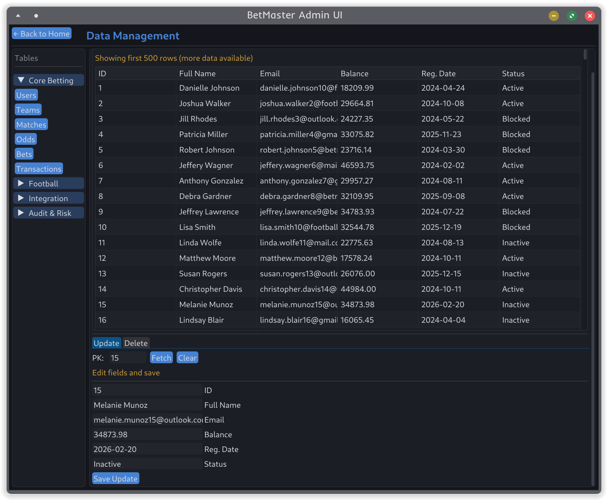

# שלב ה' - ממשק גרפי לניהול בסיס הנתונים BetMaster

ממשק ניהול גרפי לבסיס הנתונים המשולב של BetMaster. האפליקציה נכתבה ב-Python עם Dear PyGui ומתחברת ל-PostgreSQL בעזרת psycopg2.

## הוראות הפעלה

### דרישות מקדימות

- Python 3.10 ומעלה
- Docker ו-Docker Compose
- בסיס הנתונים של שלב ד' טעון ב-PostgreSQL

### 1. הפעלת PostgreSQL

מתיקיית השורש של הפרויקט:

```powershell
docker compose up -d
```

אם עובדים על מחשב נקי או volume חדש, יש לטעון את גיבוי שלב ד':

```powershell
docker exec -i betmaster_db psql -U betmaster_user -d betmaster < .\שלב_ד\backup4.sql
```

אם ה-volume כבר מכיל את הנתונים, אין להריץ את פקודת הטעינה שוב.

### 2. התקנת תלויות Python

```powershell
cd .\שלב_ה
python -m pip install -r requirements.txt
```

### 3. הרצת האפליקציה

```powershell
python main.py
```

האפליקציה מתחברת אוטומטית לכתובת:

- Host: `localhost`
- Port: `5432`
- Database: `betmaster`
- User: `betmaster_user`
- Password: `betmaster_pass`

## דרך העבודה והכלים

האפליקציה בנויה בשלוש שכבות:

| רכיב | תפקיד |
|---|---|
| `main.py` | נקודת הכניסה, פתיחת חיבור לבסיס הנתונים והרצת הממשק |
| `db/connection.py` | חיבור PostgreSQL בעזרת `psycopg2` |
| `db/repository.py` | מטא-דטה לכל 40 הטבלאות, CRUD, שאילתות שלב ב' והרצת תוכניות שלב ד' |
| `ui/app.py` | מסכי Dear PyGui, ניווט, טבלאות, טפסי יצירה/עדכון/מחיקה ותצוגת תוצאות |

הבחירה ב-Dear PyGui מאפשרת לבנות ממשק desktop נוח עם טבלאות, טפסים, תפריט צדדי, pagination ותצוגת תוצאות ללא צורך בדפדפן.

## מסכי האפליקציה

1. **Home** - מסך כניסה שממנו עוברים לניהול נתונים, שאילתות אנליטיות ותוכניות PL/pgSQL.
2. **Data Management** - מסך CRUD לכל 40 הטבלאות בבסיס הנתונים:
   - `users`, `teams`, `matches`, `odds`, `bets`, `transactions`
   - טבלאות football המשולבות
   - טבלאות המקור שהתקבלו באינטגרציה
   - טבלאות integration, audit ו-risk
3. **Actions** - מסך להרצת שאילתות שלב ב' ותתי-תוכניות שלב ד'.

## פעולות CRUD

לכל טבלה ניתן לבצע:

- **Read** - הצגת נתונים בטבלה עם pagination של 500 רשומות בכל טעינה.
- **Create** - פתיחת טופס יצירה בעזרת כפתור `+ Create`.
- **Update** - הכנסת מפתח ראשי, לחיצה על `Fetch`, טעינת שאר השדות ועדכון.
- **Delete** - הכנסת מפתח ראשי ומחיקת הרשומה.

במפתחות זרים מוצגים שמות וערכים קריאים במקום מספרי ID. לדוגמה, בהימורים מוצג שם המשתמש ותיאור המשחק במקום `user_id` ו-`match_id`.

## שאילתות שלב ב' בממשק

הממשק מאפשר להריץ 5 שאילתות:

1. `Top Recent Winners`
2. `Suspicious Winning Patterns`
3. `High-Value Regional Users`
4. `Away Team Upsets`
5. `Monthly Cash Flow`

## תוכניות ופונקציות שלב ד' בממשק

הממשק מאפשר להריץ 4 תתי-תוכניות:

1. `proc_settle_match`
2. `proc_recalculate_user_statuses`
3. `fn_match_financial_summary`
4. `fn_open_user_risk_report`

הפעלת הפרוצדורות משפיעה על טבלאות כמו `matches`, `bets`, `transactions`, `users`, `match_settlement_log`, `risk_review_queue` וטבלאות audit, כך שניתן לראות את השפעת הפעולה במסכי הנתונים.

## צילומי מסך

| מסך | תמונה |
|---|---|
| מסך הבית |  |
| ניהול נתונים ו-CRUD |  |
| שאילתות ותוכניות |  |

