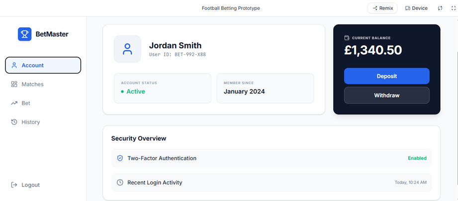
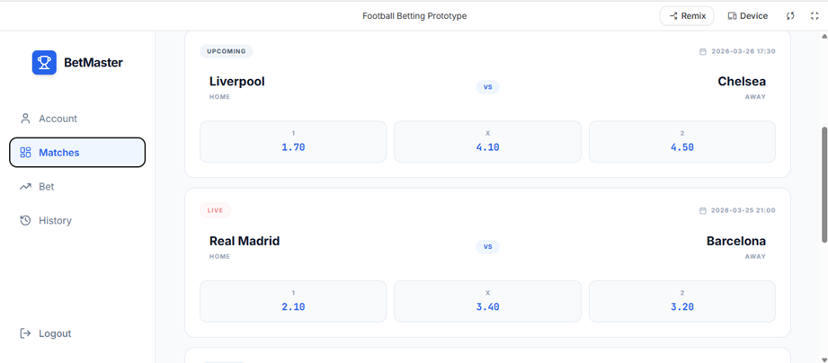
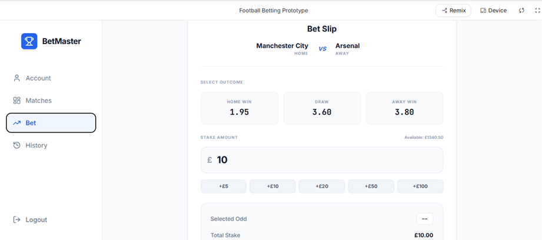
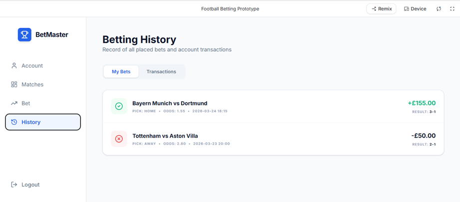
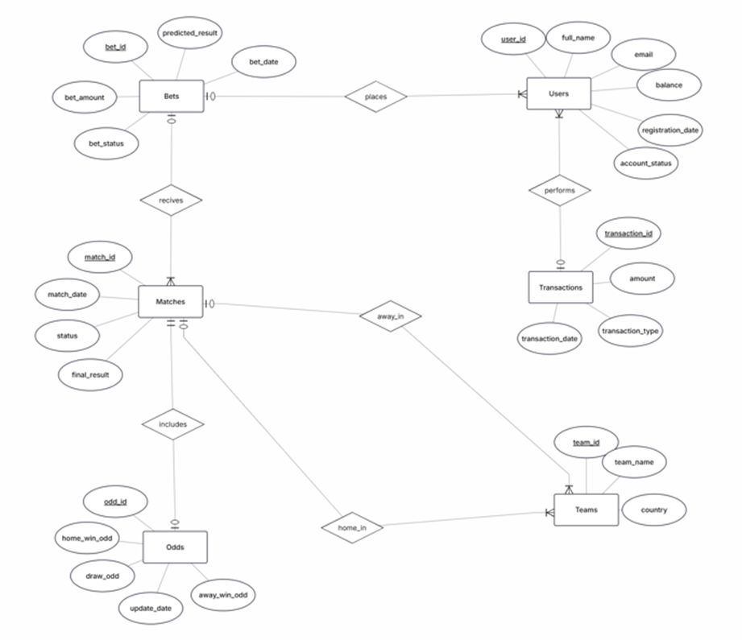
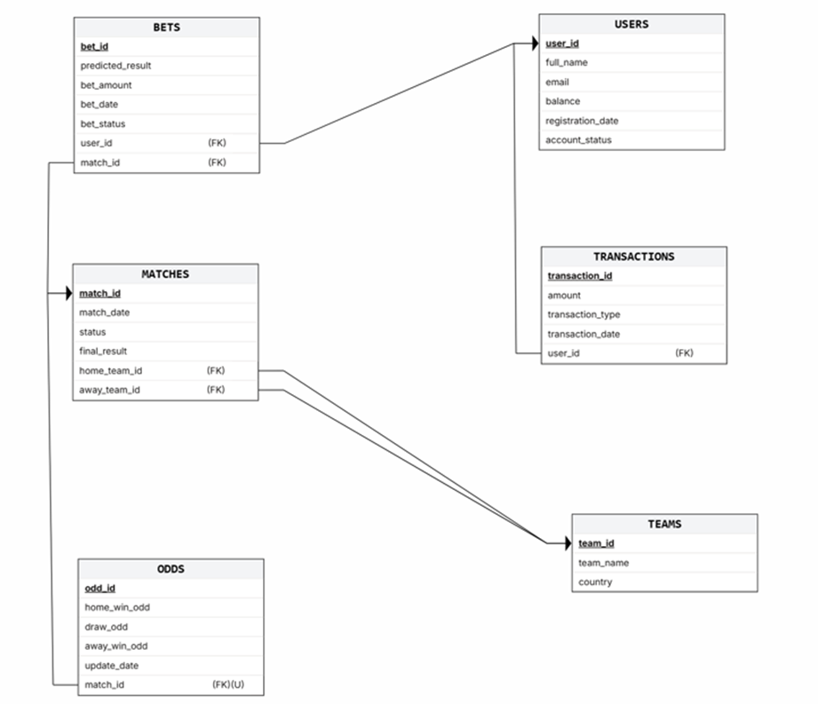
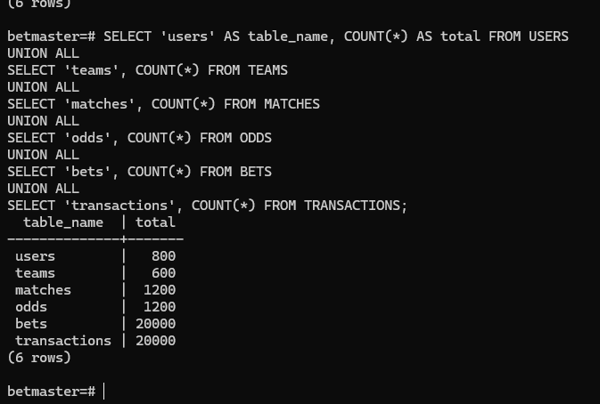
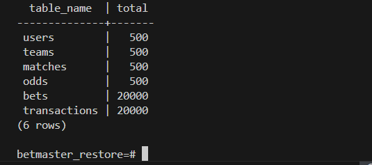
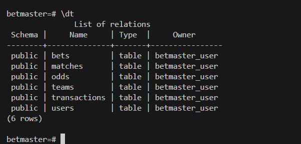
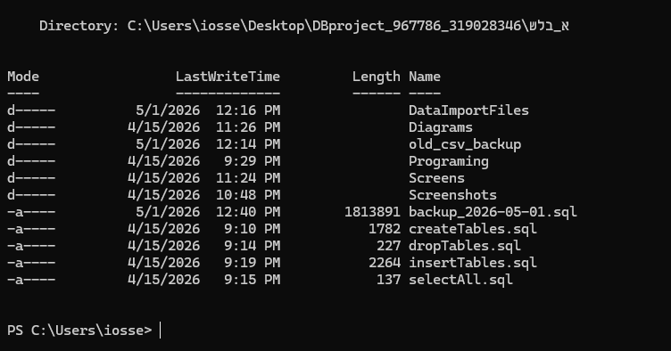

# Stage A – Design, Database Construction, Data Population and Backup

## Submitted by
- Levi Kaprow
- Tzvi Israel Ben David

## System Name
**BetMaster – A Football Betting Management System**

## Selected Unit
**Football Betting Management**

## Introduction
The system developed is a football betting management system.  
It allows users to view available matches for betting, choose a desired result, place bets according to the odds, and manage their personal account.  
In addition, the system allows users to track their betting history and their financial transactions, such as deposits and withdrawals.  
The goal of the system is to provide a convenient, clear, and organized platform for managing football bets, while maintaining a proper separation between the different data entities.

## System Description and Main Functionality
The system includes several main functions:
- Viewing matches available for betting
- Displaying odds for each possible result
- Placing a bet on a selected result
- Managing the user account
- Depositing and withdrawing funds
- Viewing betting history
- Viewing transaction history

## Google AI Studio Application Link
**Application Link:** [BetMaster App](https://aistudio.google.com/apps/6016d178-4c68-4631-b42c-c4ed68553f7f)

---

## Screen Description

### Screen 1 – User Account
This screen presents the user’s personal account details, including name, user ID, account status, and current balance.  
It also allows the user to perform financial actions such as deposits and withdrawals.

**Relevant entities:** `USERS`, `TRANSACTIONS`

[Open image](שלב_א/Screens/screen1.png)

### Screen 2 – Matches
This screen presents the list of football matches available for betting.  
For each match, the participating teams, match date, and the odds for each possible result are displayed.

**Relevant entities:** `MATCHES`, `TEAMS`, `ODDS`

[Open image](שלב_א/Screens/screen2.png)

### Screen 3 – Place Bet
This screen allows the user to choose a desired result for a specific match and enter the betting amount.  
The system calculates the bet according to the selected odds and allows the user to confirm the action.

**Relevant entities:** `BETS`, `USERS`, `MATCHES`, `ODDS`, `TRANSACTIONS`

[Open image](שלב_א/Screens/screen3.png)

### Screen 4 – History
This screen presents the history of bets placed by the user, including bet results, profits, and losses.  
It also displays the history of financial transactions performed in the account.

**Relevant entities:** `BETS`, `TRANSACTIONS`, `MATCHES`

[Open image](שלב_א/Screens/screen4.png)

---

## ERD and DSD Diagrams

### ERD

[Open ERD image](שלב_א/Diagrams/ERD.png)

### DSD

[Open DSD image](שלב_א/Diagrams/DSD.png)

---

## Entity Description
The system is based on 6 main entities:

### USERS
Contains information about users in the system, such as full name, email, balance, registration date, and account status.

### TEAMS
Contains information about football teams, such as team name and country.

### MATCHES
Contains information about matches, such as match date, match status, final result, and the participating teams.

### ODDS
Contains the odds for each match, including home win, draw, and away win.

### BETS
Contains the bets placed by users, including predicted result, bet amount, bet date, and bet status.

### TRANSACTIONS
Contains all financial actions performed by the user, such as deposits, withdrawals, bet placements, and winnings.

---

## Relationships Between Entities
The main relationships in the system are:

- One user can place many bets.
- One user can perform many transactions.
- One match can be associated with many bets.
- Each match has two teams: a home team and an away team.
- Each match has one related odds record.
- Each bet belongs to one user and one match.

---

## Schema Normalization up to 3NF
The schema was checked and found to be normalized at least up to the Third Normal Form (3NF).

Each table in the system represents a single entity, and all non-key attributes depend fully on the primary key of that table.  
In addition, a proper separation was maintained between users, teams, matches, odds, bets, and transactions, which prevents unnecessary data duplication and preserves a correct logical structure.

Examples:
- User details are stored only in the `USERS` table.
- Team details are stored only in the `TEAMS` table.
- Match details are stored only in the `MATCHES` table.
- Odds are stored only in the `ODDS` table.
- Bets are stored only in the `BETS` table.
- Transactions are stored only in the `TRANSACTIONS` table.

Therefore, the model satisfies the requirements of 3NF at the level required for this project.

---

## Design Decisions
During the design of the system, it was decided to separate the main entities in order to maintain order, clarity, and proper normalization of the data.

The data of users, matches, teams, odds, bets, and transactions were stored in separate tables in order to avoid duplication and improve database maintainability.

In addition, the system was designed to be intuitive, so that each screen represents a clear and central action for the user:
- Account management
- Viewing matches
- Placing bets
- Viewing history

---

## Technical Database Implementation
The database implementation was carried out using **VS Code**, **Docker**, and **PostgreSQL**.

A PostgreSQL container was created and configured using `docker-compose.yml`, and the database named `betmaster` was successfully launched and managed through Docker.

The following SQL scripts were prepared as required:
- `createTables.sql`
- `dropTables.sql`
- `insertTables.sql`
- `selectAll.sql`

### Main SQL Files
- [createTables.sql](שלב_א/createTables.sql)
- [dropTables.sql](שלב_א/dropTables.sql)
- [insertTables.sql](שלב_א/insertTables.sql)
- [selectAll.sql](שלב_א/selectAll.sql)

---

## Data Insertion Methods
The project includes three different methods of data insertion, as required.

### Method 1 – Manual SQL INSERT Statements
A manual insertion method was implemented using SQL commands inside:

- [insertTables.sql](שלב_א/insertTables.sql)

This file demonstrates direct insertion of sample records into the database tables.

### Method 2 – Data Generation Using Python
A Python script was written in order to generate large volumes of data automatically.

File:
- [generate_data.py](שלב_א/Programing/generate_data.py)

This script generated CSV files for all system tables.

### Method 3 – Importing Data from CSV Files
The generated CSV files were imported into PostgreSQL using CSV-based data import.

Files:
- [users.csv](שלב_א/DataImportFiles/users.csv)
- [teams.csv](שלב_א/DataImportFiles/teams.csv)
- [matches.csv](שלב_א/DataImportFiles/matches.csv)
- [odds.csv](שלב_א/DataImportFiles/odds.csv)
- [bets.csv](שלב_א/DataImportFiles/bets.csv)
- [transactions.csv](שלב_א/DataImportFiles/transactions.csv)

---

## Record Counts
According to the project requirements, each table contains at least 500 records, and two of the tables contain at least 20,000 records.

Final number of records:

- `USERS` – 500
- `TEAMS` – 500
- `MATCHES` – 500
- `ODDS` – 500
- `BETS` – 20,000
- `TRANSACTIONS` – 20,000

[Open image](שלב_א/Screenshots/record_counts.png)

---

## Backup and Restore
Two different backup methods were implemented, as required.

### Backup Method 1 – Logical Backup
A logical SQL backup of the database was created using `pg_dump`.

File:
- [backup_2026-04-15.sql](שלב_א/backup_2026-04-15.sql)

This backup contains the database structure and data in SQL format and can be restored into another database.

### Backup Method 2 – Physical Docker Volume Backup
A second backup was created by backing up the PostgreSQL Docker volume itself.

File:
- [backup_volume_2026-04-15.tar.gz](שלב_א/backup_volume_2026-04-15.tar.gz)

This backup preserves the physical contents of the database storage volume in compressed format.

### Restore Test
The backup was tested by restoring the database into a separate database named `betmaster_restore`.  
After the restore process, the data was verified successfully, and the table counts matched the original database.

[Open image](שלב_א/Screenshots/restore_counts.png)

---

## Screenshots

### Tables Created

[Open image](שלב_א/Screenshots/tables_created.png)

### Record Counts

[Open image](שלב_א/Screenshots/record_counts.png)

### Backup Files

[Open image](שלב_א/Screenshots/backup_files.png)

### Restore Verification

[Open image](שלב_א/Screenshots/restore_counts.png)

---

## Conclusion
The designed system provides an organized and clear foundation for managing football betting.

Through the four defined system screens, the six central entities, and the relationships between them, an initial model was built in accordance with the project requirements.  
The system supports the management of users, matches, teams, odds, bets, and transactions while maintaining a valid and normalized database structure.

In addition, the database was implemented in practice, populated with data using three different methods, backed up in two different ways, and successfully restored and verified.
