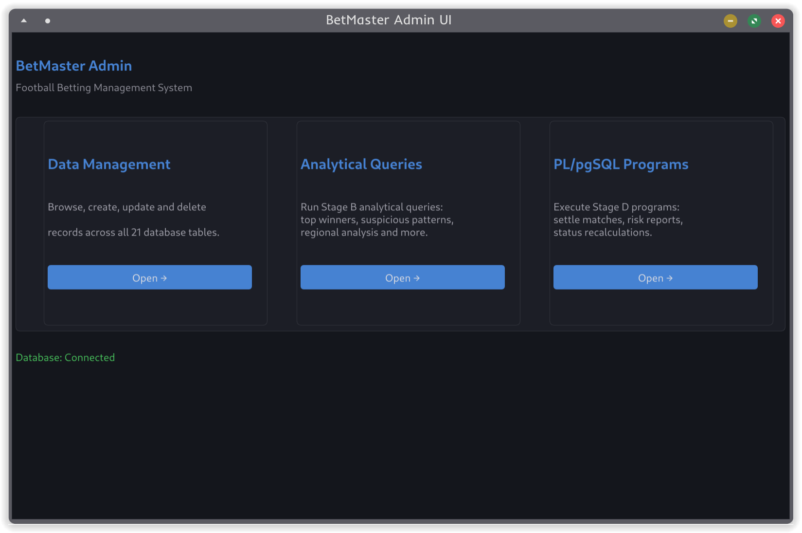
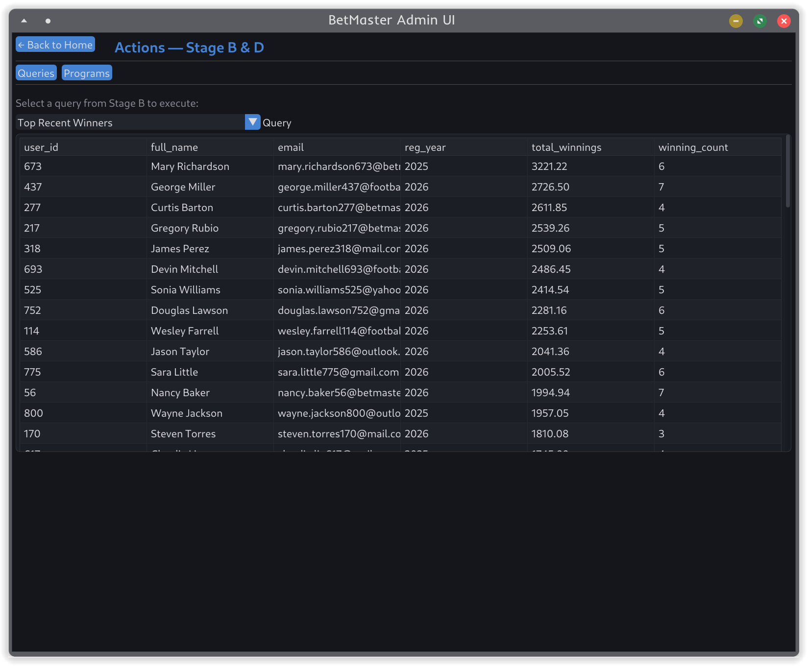

# BetMaster - מערכת לניהול הימורי כדורגל

BetMaster היא מערכת בסיס נתונים מקיפה שנועדה לנהל פעולות הימורי כדורגל. המערכת עוקבת אחר משתמשים, קבוצות כדורגל, משחקים, יחסי הימורים, הימורים שבוצעו ועסקאות כספיות.

## סקירת המערכת

המערכת מספקת פלטפורמה עבור:

- צפייה במשחקי כדורגל מתוכננים.
- ניתוח יחסי הימורים.
- ביצוע הימורים על תוצאות משחקים.
- ניהול יתרות משתמשים ועסקאות כספיות.
- מעקב אחר ביצועים היסטוריים ורצפי זכיות.

## קישור לאפליקציה ב-Google AI Studio

**קישור לאפליקציה:** [BetMaster App](https://aistudio.google.com/apps/6016d178-4c68-4631-b42c-c4ed68553f7f)

## מסכים

### מסך 1 - חשבון משתמש

מסך זה מציג את פרטי החשבון האישיים של המשתמש, כולל שם המשתמש, מזהה המשתמש, סטטוס החשבון והיתרה הנוכחית. בנוסף, הוא מאפשר פעולות כספיות כגון הפקדות ומשיכות.

**ישויות רלוונטיות:** `USERS`, `TRANSACTIONS`


### מסך 2 - משחקים

מסך זה מציג את רשימת משחקי הכדורגל הזמינים להימור, כולל הקבוצות המשתתפות, תאריך המשחק, הסטטוס ויחסי ההימורים.

**ישויות רלוונטיות:** `MATCHES`, `TEAMS`, `ODDS`


### מסך 3 - ביצוע הימור

מסך זה מאפשר למשתמש לבחור משחק מסוים, לבחור תוצאה צפויה, להזין סכום הימור ולאשר את ההימור.

**ישויות רלוונטיות:** `BETS`, `USERS`, `MATCHES`, `ODDS`, `TRANSACTIONS`


### מסך 4 - היסטוריה

מסך זה מציג את היסטוריית ההימורים והיסטוריית העסקאות הכספיות של המשתמש, כולל רווחים, הפסדים ופעולות חשבון.

**ישויות רלוונטיות:** `BETS`, `TRANSACTIONS`, `MATCHES`


## טכנולוגיות

- **Database:** PostgreSQL 16
- **Containerization:** Docker ו-Docker Compose
- **Data Generation:** Python 3
- **Tools:** VS Code, pg_dump, Dear PyGui, psycopg2

## תכנון בסיס הנתונים

ה-schema מנורמל והורחב בשלב האינטגרציה. בסיס הנתונים הסופי כולל את טבלאות BetMaster המקוריות, ה-schema שהתקבל ממערכת ניהול הכדורגל, טבלאות כדורגל משולבות, טבלאות מיפוי אינטגרציה וטבלאות audit וסיכון משלב ד'.

### ישויות מרכזיות

- **USERS:** פרופילים, יתרות וסטטוס חשבון.
- **TEAMS:** פרטי קבוצות ומדינת מקור.
- **MATCHES:** תאריכים, קבוצות משתתפות ותוצאות סופיות.
- **ODDS:** יחסי הימורים דינמיים המקושרים למשחקים.
- **BETS:** רשומות של הימורים, תחזיות ותוצאות.
- **TRANSACTIONS:** לוג כספי של כל פעולות החשבון.

### תרשימים

- **ERD:** [פתיחת ERD](שלב_א/Diagrams/ERD.png)
- **DSD:** [פתיחת DSD](שלב_א/Diagrams/DSD.png)
- **ERD משולב:** [פתיחת ERD משולב](שלב_ג/Diagrams/integrated_ERD.png)
- **DSD משולב:** [פתיחת DSD משולב](שלב_ג/Diagrams/integrated_DSD.png)

## התחלה והפעלה

### דרישות מקדימות

- Docker ו-Docker Compose
- Python 3.10 ומעלה עבור הממשק הגרפי של שלב ה'

### הרצת בסיס הנתונים

הפעלת PostgreSQL:

```powershell
docker compose up -d
```

בסיס הנתונים זמין בכתובת `localhost:5432`.

- **User:** `betmaster_user`
- **Password:** `betmaster_pass`
- **Database:** `betmaster`

במחשב נקי או Docker volume ריק, יש לשחזר את גיבוי שלב ד':

```powershell
docker exec -i betmaster_db psql -U betmaster_user -d betmaster < .\שלב_ד\backup4.sql
```

## מבנה הפרויקט

- `שלב_א/`: שלב א' - schema design, יצירת נתונים, גיבוי ומסכים ראשוניים.
- `שלב_ב/`: שלב ב' - Advanced Queries, Indexes, Constraints ו-Transactions.
- `שלב_ג/`: שלב ג' - אינטגרציה עם בסיס נתוני הכדורגל שהתקבל.
- `שלב_ד/`: שלב ד' - PL/pgSQL Functions, Procedures, Triggers וטבלאות audit.
- `שלב_ה/`: שלב ה' - ממשק גרפי לבסיס הנתונים.
- `DBProject/שלב ה/`: עותק הגשה עבור שלב ה'.
- `docker-compose.yml`: תשתית PostgreSQL.

## שלב ה' - ממשק גרפי לבסיס הנתונים

שלב ה' מוסיף ממשק ניהול שולחני עבור בסיס הנתונים המשולב של BetMaster.

### הוראות הפעלה

1. הפעלת PostgreSQL:

   ```powershell
   docker compose up -d
   ```

2. אם ה-Docker volume ריק, יש לשחזר את בסיס הנתונים של שלב ד':

   ```powershell
   docker exec -i betmaster_db psql -U betmaster_user -d betmaster < .\שלב_ד\backup4.sql
   ```

3. התקנת תלויות הממשק הגרפי:

   ```powershell
   cd .\שלב_ה
   python -m pip install -r requirements.txt
   ```

4. הרצת האפליקציה:

   ```powershell
   python main.py
   ```

האפליקציה מתחברת ל-`localhost:5432`, לבסיס הנתונים `betmaster`, עם המשתמש `betmaster_user` והסיסמה `betmaster_pass`.

### כלים ששימשו לממשק הגרפי

- **Python 3** עבור קוד האפליקציה.
- **Dear PyGui** עבור ממשק שולחני גרפי.
- **psycopg2-binary** עבור גישה ל-PostgreSQL.
- **Docker Compose** עבור הרצת PostgreSQL 16.

### כיסוי האפליקציה

הממשק הגרפי מספק גישה לכל **40 הטבלאות הציבוריות** בבסיס הנתונים המשולב:

- טבלאות BetMaster המקוריות
- טבלאות ניהול הכדורגל שהתקבלו
- טבלאות כדורגל משולבות ומנורמלות
- טבלאות מיפוי אינטגרציה
- טבלאות audit וסיכון של שלב ד'

פעולות נתמכות:

- Create, Read, Update ו-Delete של רשומות ממסכי הטבלאות.
- תהליך Update לפי primary key: הכנסת מפתח, שליפת הרשומה הקיימת, עריכת שדות ושמירה.
- הצגת Foreign Keys כערכים קריאים במקום מזהים מספריים.
- הרצת Stage B Queries.
- הרצת Stage D Procedures ו-Functions.

Stage B Queries הזמינים בממשק:

- `Top Recent Winners`
- `Suspicious Winning Patterns`
- `High-Value Regional Users`
- `Away Team Upsets`
- `Monthly Cash Flow`

Stage D Programs הזמינים בממשק:

- `proc_settle_match`
- `proc_recalculate_user_statuses`
- `fn_match_financial_summary`
- `fn_open_user_risk_report`

### צילומי מסך של שלב ה'





