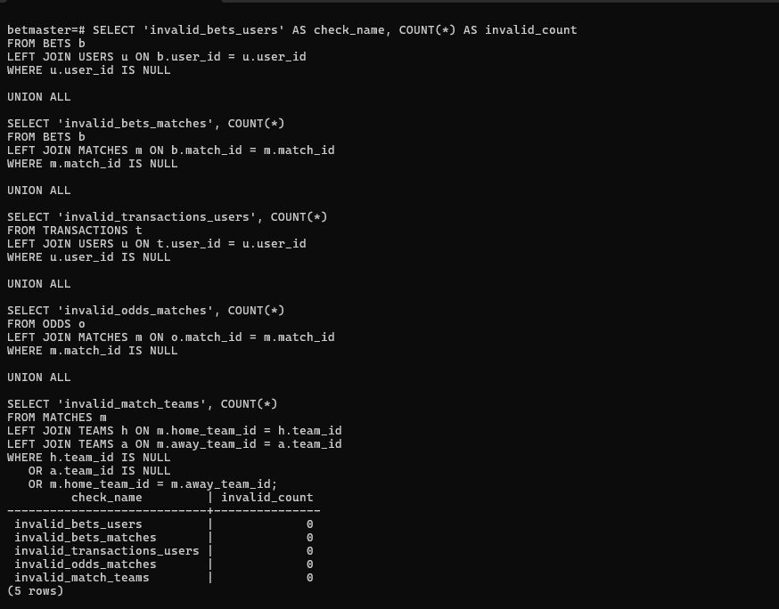

# Stage A – Design, Database Construction, Data Population and Backup

## Submitted by
- Levi Kaprow
- Tzvi Israel Ben David

## System Name
**BetMaster – A Football Betting Management System**

## Selected Unit
**Football Betting Management**

---

## Introduction

BetMaster is a football betting management system.

The system allows users to view available football matches, check the odds for each possible result, place bets, manage their personal account balance, and view their betting and transaction history.

The goal of the system is to provide a clear, organized, and realistic database model for a football betting platform while maintaining correct relationships between the different entities and preserving database normalization.

---

## System Description and Main Functionality

The system supports the following main actions:

- Viewing available football matches
- Viewing betting odds for each match
- Placing a bet on a selected result
- Managing user account details
- Depositing and withdrawing funds
- Viewing betting history
- Viewing transaction history
- Tracking match results and bet statuses

---

## Google AI Studio Application Link

**Application Link:** [BetMaster App](https://aistudio.google.com/apps/6016d178-4c68-4631-b42c-c4ed68553f7f)

---

# Screens

## Screen 1 – User Account

This screen presents the user’s personal account details, including the user name, user ID, account status, and current balance.

It also allows the user to perform financial actions such as deposits and withdrawals.

**Relevant entities:** `USERS`, `TRANSACTIONS`


[Open Screen 1](Screens/screen1.png)

---

## Screen 2 – Matches

This screen presents the list of football matches available for betting.

For each match, the system displays the participating teams, match date, match status, and the odds for each possible result.

**Relevant entities:** `MATCHES`, `TEAMS`, `ODDS`


[Open Screen 2](Screens/screen2.png)

---

## Screen 3 – Place Bet

This screen allows the user to choose a specific match, select a predicted result, enter a betting amount, and confirm the bet.

The bet is connected to the selected user and match.

**Relevant entities:** `BETS`, `USERS`, `MATCHES`, `ODDS`, `TRANSACTIONS`


[Open Screen 3](Screens/screen3.png)

---

## Screen 4 – History

This screen presents the user’s betting history and financial transaction history.

The user can see previous bets, bet results, profits, losses, deposits, withdrawals, and other account actions.

**Relevant entities:** `BETS`, `TRANSACTIONS`, `MATCHES`


[Open Screen 4](Screens/screen4.png)

---

# ERD and DSD Diagrams

## ERD

The ERD describes the conceptual structure of the system, including the main entities, their attributes, and the relationships between them.


[Open ERD](Diagrams/ERD.png)

---

## DSD

The DSD describes the relational database structure, including tables, primary keys, foreign keys, and the connections between the tables.


[Open DSD](Diagrams/DSD.png)

---

# Entity Description

The system is based on 6 main entities.

## USERS

Stores information about the users of the system.

Main attributes:

- `user_id`
- `full_name`
- `email`
- `balance`
- `registration_date`
- `account_status`

---

## TEAMS

Stores information about football teams.

Main attributes:

- `team_id`
- `team_name`
- `country`

---

## MATCHES

Stores information about football matches.

Main attributes:

- `match_id`
- `match_date`
- `status`
- `final_result`
- `home_team_id`
- `away_team_id`

Each match has a home team and an away team.

---

## ODDS

Stores the betting odds for each match.

Main attributes:

- `odd_id`
- `home_win_odd`
- `draw_odd`
- `away_win_odd`
- `update_date`
- `match_id`

Each match has one related odds record.

---

## BETS

Stores the bets placed by users.

Main attributes:

- `bet_id`
- `predicted_result`
- `bet_amount`
- `bet_date`
- `bet_status`
- `user_id`
- `match_id`

Each bet belongs to one user and one match.

---

## TRANSACTIONS

Stores the financial transactions performed by users.

Main attributes:

- `transaction_id`
- `amount`
- `transaction_type`
- `transaction_date`
- `user_id`

Examples of transaction types:

- Deposit
- Withdrawal
- Bet Placement
- Winnings

---

# Relationships Between Entities

The main relationships in the system are:

- One user can place many bets.
- One user can perform many transactions.
- One match can have many bets.
- Each match has one home team.
- Each match has one away team.
- Each match has one odds record.
- Each bet belongs to one user.
- Each bet belongs to one match.
- Each transaction belongs to one user.

## Foreign Key Relationships

The foreign key relationships are:

- `BETS.user_id` references `USERS.user_id`
- `BETS.match_id` references `MATCHES.match_id`
- `TRANSACTIONS.user_id` references `USERS.user_id`
- `MATCHES.home_team_id` references `TEAMS.team_id`
- `MATCHES.away_team_id` references `TEAMS.team_id`
- `ODDS.match_id` references `MATCHES.match_id`

---

# Schema Normalization up to 3NF

The schema was checked and found to be normalized at least up to the Third Normal Form.

Each table represents one clear entity, and all non-key attributes depend on the primary key of that table.

Examples:

- User details are stored only in the `USERS` table.
- Team details are stored only in the `TEAMS` table.
- Match details are stored only in the `MATCHES` table.
- Odds are stored only in the `ODDS` table.
- Bets are stored only in the `BETS` table.
- Transactions are stored only in the `TRANSACTIONS` table.

This separation prevents unnecessary duplication and keeps the database structure organized and maintainable.

---

# Design Decisions

The database was designed with a clear separation between the main entities.

The purpose of this separation is to:

- Avoid duplicated data
- Preserve normalization
- Make the database easier to maintain
- Keep the relationships between tables clear
- Support future expansion of the system

The system screens were also designed according to the main user actions:

- Account management
- Viewing matches
- Placing bets
- Viewing history

---

# Technical Database Implementation

The database implementation was carried out using:

- PostgreSQL
- Docker
- Docker Compose
- VS Code
- Python

A PostgreSQL container was created and configured using `docker-compose.yml`.

The main database is named:

```text
betmaster
```

The main Docker container is named:

```text
betmaster_db
```

---

# SQL Files

The following SQL files were prepared for the project:

- [createTables.sql](createTables.sql)
- [dropTables.sql](dropTables.sql)
- [insertTables.sql](insertTables.sql)
- [selectAll.sql](selectAll.sql)

## File Purposes

### createTables.sql

Creates the database tables, primary keys, foreign keys, and constraints.

### dropTables.sql

Drops the existing tables in the correct order so the database can be recreated.

### insertTables.sql

Contains manual SQL insert examples.

### selectAll.sql

Displays records from the database tables.

---

# Data Insertion Methods

The project includes three different data insertion methods.

---

## Method 1 – Manual SQL INSERT Statements

Manual insertion was implemented using SQL commands inside:

- [insertTables.sql](insertTables.sql)

This file demonstrates how records can be inserted directly into the database tables using SQL.

---

## Method 2 – Data Generation Using Python

A Python script was written to generate a large amount of realistic data automatically.

File:

- [generate_data.py](Programming/generate_data.py)

The script uses the `Faker` library to generate realistic data such as:

- User names
- Emails
- Team names
- Countries
- Dates
- Financial values

This was done in order to avoid artificial values such as:

```text
User 1
Team 1
Country 1
```

Instead, the generated data contains realistic names and readable textual values.

---

## Foreign Key Handling in Python

The Python script was also designed to respect all foreign key relationships.

The logic is based on generating parent tables first and then using only existing IDs when generating child tables.

Generation order:

1. `USERS`
2. `TEAMS`
3. `MATCHES`
4. `ODDS`
5. `BETS`
6. `TRANSACTIONS`

This ensures that every foreign key points to an existing primary key.

Examples:

- `BETS.user_id` is selected only from existing `USERS.user_id` values.
- `BETS.match_id` is selected only from existing `MATCHES.match_id` values.
- `TRANSACTIONS.user_id` is selected only from existing `USERS.user_id` values.
- `MATCHES.home_team_id` is selected only from existing `TEAMS.team_id` values.
- `MATCHES.away_team_id` is selected only from existing `TEAMS.team_id` values.
- `ODDS.match_id` is selected only from existing `MATCHES.match_id` values.

The script also prevents a match from having the same team as both home team and away team.

---

## Method 3 – Importing Data from CSV Files

The generated CSV files were imported into PostgreSQL.

CSV files:

- [users.csv](DataImportFiles/users.csv)
- [teams.csv](DataImportFiles/teams.csv)
- [matches.csv](DataImportFiles/matches.csv)
- [odds.csv](DataImportFiles/odds.csv)
- [bets.csv](DataImportFiles/bets.csv)
- [transactions.csv](DataImportFiles/transactions.csv)

The import order follows the foreign key dependency order:

1. `USERS`
2. `TEAMS`
3. `MATCHES`
4. `ODDS`
5. `BETS`
6. `TRANSACTIONS`

This order ensures that all parent records exist before child records are imported.

---

# Record Counts

According to the project requirements, the database contains more than 500 records in the main tables, and two tables contain at least 20,000 records.

Final number of records:

| Table | Number of Records |
|---|---:|
| `USERS` | 800 |
| `TEAMS` | 600 |
| `MATCHES` | 1,200 |
| `ODDS` | 1,200 |
| `BETS` | 20,000 |
| `TRANSACTIONS` | 20,000 |


[Open Record Counts Screenshot](Screenshots/record_counts.png)

---

# Foreign Key Validation

After importing the CSV files into PostgreSQL, the foreign key relationships were validated.

The validation checked that:

- Every bet references an existing user.
- Every bet references an existing match.
- Every transaction references an existing user.
- Every odds record references an existing match.
- Every match references existing teams.
- No match contains the same team as both home team and away team.

All validation checks returned:

```text
0 invalid records
```

This confirms that the generated data respects the database relationships and foreign key constraints.



[Open Foreign Key Validation Screenshot](Screenshots/fk_validation.png)

---

# Backup and Restore

Two backup methods were implemented.

---

## Backup Method 1 – Logical SQL Backup

A logical SQL backup of the database was created using `pg_dump`.

File:

- [backup_2026-05-01.sql](backup_2026-05-01.sql)

This backup contains the database structure and data in SQL format.

It can be restored into another PostgreSQL database.

---

## Backup Method 2 – Physical Docker Volume Backup

A second backup was created by backing up the PostgreSQL Docker volume itself.

File:

- [backup_volume_2026-05-01.tar.gz](backup_volume_2026-05-01.tar.gz)

This backup preserves the physical contents of the PostgreSQL database storage volume in compressed format.

---

## Restore Test

The logical backup was tested by restoring the database into a separate database named:

```text
betmaster_restore
```

After the restore process, the data was verified successfully.

The restored database contained the same record counts as the original database:

| Table | Number of Records |
|---|---:|
| `USERS` | 800 |
| `TEAMS` | 600 |
| `MATCHES` | 1,200 |
| `ODDS` | 1,200 |
| `BETS` | 20,000 |
| `TRANSACTIONS` | 20,000 |


[Open Restore Counts Screenshot](Screenshots/restore_counts.png)

---

# Screenshots

## Tables Created

This screenshot shows that the six required database tables were created successfully.


[Open Tables Created Screenshot](Screenshots/tables_created.png)

---

## Record Counts

This screenshot shows the final number of records in each table.


[Open Record Counts Screenshot](Screenshots/record_counts.png)

---

## Foreign Key Validation

This screenshot shows that all foreign key validation checks returned zero invalid records.


[Open Foreign Key Validation Screenshot](Screenshots/fk_validation.png)

---

## Backup Files

This screenshot shows the updated backup files:

- `backup_2026-05-01.sql`
- `backup_volume_2026-05-01.tar.gz`


[Open Backup Files Screenshot](Screenshots/backup_files.png)

---

## Restore Verification

This screenshot shows that the backup was restored successfully into `betmaster_restore`.


[Open Restore Verification Screenshot](Screenshots/restore_counts.png)

---

# Project Files Structure

The main files of Stage A are organized as follows:

```text
שלב_א
│
├── DataImportFiles
│   ├── users.csv
│   ├── teams.csv
│   ├── matches.csv
│   ├── odds.csv
│   ├── bets.csv
│   └── transactions.csv
│
├── Diagrams
│   ├── ERD.png
│   └── DSD.png
│
├── Programming
│   └── generate_data.py
│
├── Screens
│   ├── screen1.png
│   ├── screen2.png
│   ├── screen3.png
│   └── screen4.png
│
├── Screenshots
│   ├── tables_created.png
│   ├── record_counts.png
│   ├── fk_validation.png
│   ├── backup_files.png
│   └── restore_counts.png
│
├── createTables.sql
├── dropTables.sql
├── insertTables.sql
├── selectAll.sql
├── backup_2026-05-01.sql
├── backup_volume_2026-05-01.tar.gz
└── README.md
```

---

# Conclusion

The designed system provides an organized and clear foundation for managing a football betting database.

The project includes four system screens, six main database entities, ERD and DSD diagrams, SQL implementation files, generated data, CSV imports, backup files, and restore verification.

The data generation process was improved to use realistic names and values using the `Faker` library.

In addition, the generated data was validated to ensure that all foreign key relationships are respected.

The database was successfully populated, backed up using two different methods, restored into a separate database, and verified using record count checks.
