# שלב א' - תכנון, בניית בסיס הנתונים, טעינת נתונים וגיבוי

## הוגש על ידי

- Levi Kaprow
- Tzvi Israel Ben David

## שם המערכת

**BetMaster - מערכת לניהול הימורי כדורגל**

## היחידה שנבחרה

**ניהול הימורי כדורגל**

---

## הקדמה

BetMaster היא מערכת לניהול הימורי כדורגל.

המערכת מאפשרת למשתמשים לצפות במשחקי כדורגל זמינים, לבדוק את יחסי ההימורים לכל תוצאה אפשרית, לבצע הימורים, לנהל את יתרת החשבון האישית שלהם ולצפות בהיסטוריית ההימורים והעסקאות.

מטרת המערכת היא לספק מודל בסיס נתונים ברור, מאורגן וריאלי עבור פלטפורמת הימורי כדורגל, תוך שמירה על קשרים תקינים בין הישויות השונות ועל נרמול בסיס הנתונים.

---

## תיאור המערכת והפונקציונליות המרכזית

המערכת תומכת בפעולות המרכזיות הבאות:

- צפייה במשחקי כדורגל זמינים
- צפייה ביחסי הימורים לכל משחק
- ביצוע הימור על תוצאה נבחרת
- ניהול פרטי חשבון משתמש
- הפקדה ומשיכת כספים
- צפייה בהיסטוריית הימורים
- צפייה בהיסטוריית עסקאות
- מעקב אחר תוצאות משחקים וסטטוס הימורים

---

## קישור לאפליקציה ב-Google AI Studio

**קישור לאפליקציה:** [BetMaster App](https://aistudio.google.com/apps/6016d178-4c68-4631-b42c-c4ed68553f7f)

---

# מסכים

## מסך 1 - חשבון משתמש

מסך זה מציג את פרטי החשבון האישיים של המשתמש, כולל שם המשתמש, מזהה המשתמש, סטטוס החשבון והיתרה הנוכחית.

בנוסף, המסך מאפשר למשתמש לבצע פעולות כספיות כגון הפקדות ומשיכות.

**ישויות רלוונטיות:** `USERS`, `TRANSACTIONS`

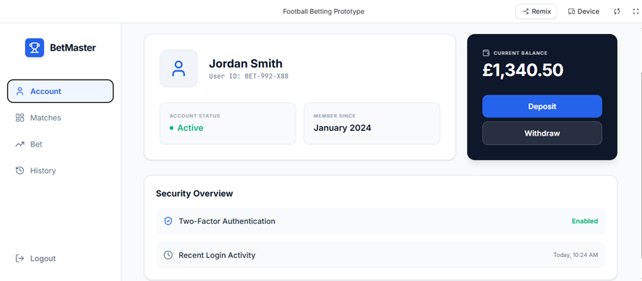

[פתיחת מסך 1](Screens/screen1.png)

---

## מסך 2 - משחקים

מסך זה מציג את רשימת משחקי הכדורגל הזמינים להימור.

עבור כל משחק, המערכת מציגה את הקבוצות המשתתפות, תאריך המשחק, סטטוס המשחק ויחסי ההימורים לכל תוצאה אפשרית.

**ישויות רלוונטיות:** `MATCHES`, `TEAMS`, `ODDS`

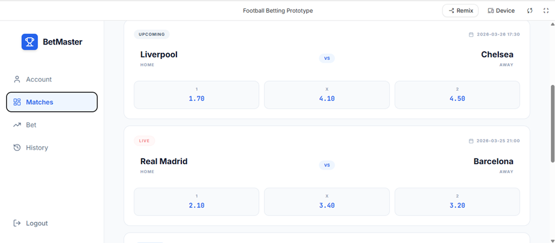

[פתיחת מסך 2](Screens/screen2.png)

---

## מסך 3 - ביצוע הימור

מסך זה מאפשר למשתמש לבחור משחק מסוים, לבחור תוצאה צפויה, להזין סכום הימור ולאשר את ההימור.

ההימור מקושר למשתמש שנבחר ולמשחק שנבחר.

**ישויות רלוונטיות:** `BETS`, `USERS`, `MATCHES`, `ODDS`, `TRANSACTIONS`

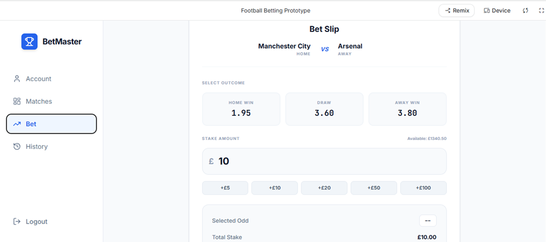

[פתיחת מסך 3](Screens/screen3.png)

---

## מסך 4 - היסטוריה

מסך זה מציג את היסטוריית ההימורים ואת היסטוריית העסקאות הכספיות של המשתמש.

המשתמש יכול לראות הימורים קודמים, תוצאות הימורים, רווחים, הפסדים, הפקדות, משיכות ופעולות נוספות בחשבון.

**ישויות רלוונטיות:** `BETS`, `TRANSACTIONS`, `MATCHES`

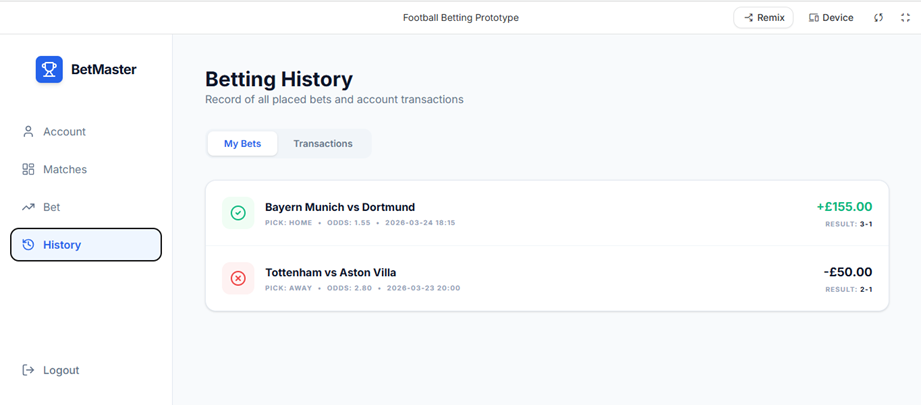

[פתיחת מסך 4](Screens/screen4.png)

---

# תרשימי ERD ו-DSD

## ERD

תרשים ה-ERD מתאר את המבנה הקונספטואלי של המערכת, כולל הישויות המרכזיות, המאפיינים שלהן והקשרים ביניהן.

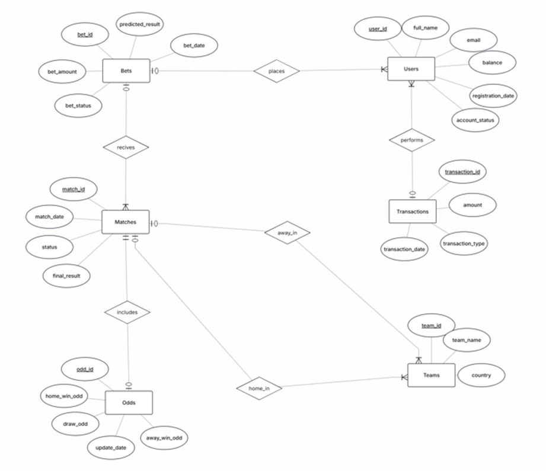

[פתיחת ERD](Diagrams/ERD.png)

---

## DSD

תרשים ה-DSD מתאר את מבנה בסיס הנתונים הרלציוני, כולל טבלאות, מפתחות ראשיים, מפתחות זרים והקשרים בין הטבלאות.

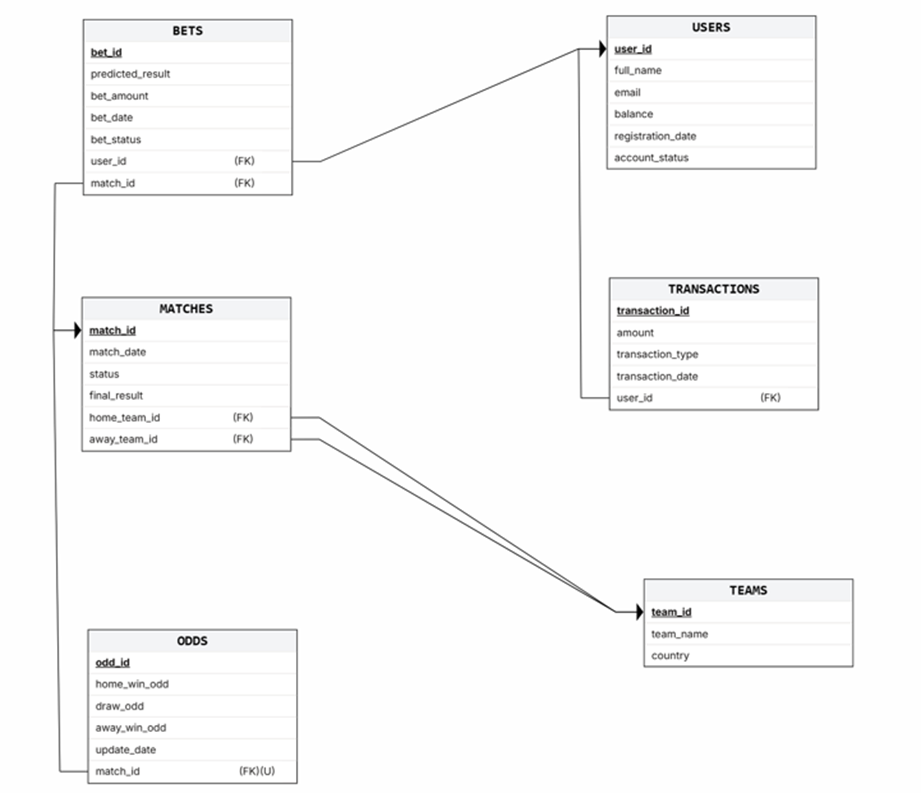

[פתיחת DSD](Diagrams/DSD.png)

---

# תיאור הישויות

המערכת מבוססת על 6 ישויות מרכזיות.

## USERS

שומרת מידע על המשתמשים במערכת.

מאפיינים מרכזיים:

- `user_id`
- `full_name`
- `email`
- `balance`
- `registration_date`
- `account_status`

---

## TEAMS

שומרת מידע על קבוצות כדורגל.

מאפיינים מרכזיים:

- `team_id`
- `team_name`
- `country`

---

## MATCHES

שומרת מידע על משחקי כדורגל.

מאפיינים מרכזיים:

- `match_id`
- `match_date`
- `status`
- `final_result`
- `home_team_id`
- `away_team_id`

לכל משחק יש קבוצת בית וקבוצת חוץ.

---

## ODDS

שומרת את יחסי ההימורים עבור כל משחק.

מאפיינים מרכזיים:

- `odd_id`
- `home_win_odd`
- `draw_odd`
- `away_win_odd`
- `update_date`
- `match_id`

לכל משחק יש רשומת יחסי הימורים אחת מקושרת.

---

## BETS

שומרת את ההימורים שבוצעו על ידי משתמשים.

מאפיינים מרכזיים:

- `bet_id`
- `predicted_result`
- `bet_amount`
- `bet_date`
- `bet_status`
- `user_id`
- `match_id`

כל הימור שייך למשתמש אחד ולמשחק אחד.

---

## TRANSACTIONS

שומרת את העסקאות הכספיות שבוצעו על ידי משתמשים.

מאפיינים מרכזיים:

- `transaction_id`
- `amount`
- `transaction_type`
- `transaction_date`
- `user_id`

דוגמאות לסוגי עסקאות:

- Deposit
- Withdrawal
- Bet Placement
- Winnings

---

# קשרים בין הישויות

הקשרים המרכזיים במערכת הם:

- משתמש אחד יכול לבצע הימורים רבים.
- משתמש אחד יכול לבצע עסקאות רבות.
- משחק אחד יכול להכיל הימורים רבים.
- לכל משחק יש קבוצת בית אחת.
- לכל משחק יש קבוצת חוץ אחת.
- לכל משחק יש רשומת יחסי הימורים אחת.
- כל הימור שייך למשתמש אחד.
- כל הימור שייך למשחק אחד.
- כל עסקה שייכת למשתמש אחד.

## קשרי מפתחות זרים

קשרי המפתחות הזרים הם:

- `BETS.user_id` מפנה אל `USERS.user_id`
- `BETS.match_id` מפנה אל `MATCHES.match_id`
- `TRANSACTIONS.user_id` מפנה אל `USERS.user_id`
- `MATCHES.home_team_id` מפנה אל `TEAMS.team_id`
- `MATCHES.away_team_id` מפנה אל `TEAMS.team_id`
- `ODDS.match_id` מפנה אל `MATCHES.match_id`

---

# נרמול הסכמה עד 3NF

הסכמה נבדקה ונמצאה מנורמלת לפחות עד הצורה הנורמלית השלישית.

כל טבלה מייצגת ישות ברורה אחת, וכל המאפיינים שאינם מפתח תלויים במפתח הראשי של אותה טבלה.

דוגמאות:

- פרטי משתמש נשמרים רק בטבלת `USERS`.
- פרטי קבוצה נשמרים רק בטבלת `TEAMS`.
- פרטי משחק נשמרים רק בטבלת `MATCHES`.
- יחסי הימורים נשמרים רק בטבלת `ODDS`.
- הימורים נשמרים רק בטבלת `BETS`.
- עסקאות נשמרות רק בטבלת `TRANSACTIONS`.

הפרדה זו מונעת כפילויות מיותרות ושומרת על מבנה בסיס נתונים מאורגן וקל לתחזוקה.

---

# החלטות תכנון

בסיס הנתונים תוכנן עם הפרדה ברורה בין הישויות המרכזיות.

מטרת ההפרדה היא:

- למנוע כפילות נתונים
- לשמור על נרמול
- להפוך את בסיס הנתונים לקל יותר לתחזוקה
- לשמור על קשרים ברורים בין הטבלאות
- לאפשר הרחבה עתידית של המערכת

מסכי המערכת תוכננו גם הם לפי פעולות המשתמש המרכזיות:

- ניהול חשבון
- צפייה במשחקים
- ביצוע הימור
- צפייה בהיסטוריה

---

# מימוש טכני של בסיס הנתונים

מימוש בסיס הנתונים בוצע באמצעות:

- PostgreSQL
- Docker
- Docker Compose
- VS Code
- Python

נוצר והוגדר קונטיינר PostgreSQL באמצעות `docker-compose.yml`.

שם בסיס הנתונים הראשי:

```text
betmaster
```

שם קונטיינר Docker הראשי:

```text
betmaster_db
```

---

# קבצי SQL

הקבצים הבאים הוכנו עבור הפרויקט:

- [createTables.sql](createTables.sql)
- [dropTables.sql](dropTables.sql)
- [insertTables.sql](insertTables.sql)
- [selectAll.sql](selectAll.sql)

## מטרת הקבצים

### createTables.sql

יוצר את טבלאות בסיס הנתונים, מפתחות ראשיים, מפתחות זרים ואילוצים.

### dropTables.sql

מוחק את הטבלאות הקיימות בסדר הנכון כדי שניתן יהיה ליצור מחדש את בסיס הנתונים.

### insertTables.sql

כולל דוגמאות להכנסות ידניות ב-SQL.

### selectAll.sql

מציג רשומות מטבלאות בסיס הנתונים.

---

# שיטות הכנסת נתונים

הפרויקט כולל שלוש שיטות שונות להכנסת נתונים.

---

## שיטה 1 - פקודות INSERT ידניות ב-SQL

הכנסה ידנית מומשה באמצעות פקודות SQL בתוך:

- [insertTables.sql](insertTables.sql)

קובץ זה מדגים כיצד ניתן להכניס רשומות ישירות לטבלאות בסיס הנתונים באמצעות SQL.

---

## שיטה 2 - יצירת נתונים באמצעות Python

נכתב סקריפט Python ליצירת כמות גדולה של נתונים ריאליים באופן אוטומטי.

קובץ:

- [generate_data.py](Programming/generate_data.py)

הסקריפט משתמש בספריית `Faker` כדי ליצור נתונים ריאליים כגון:

- שמות משתמשים
- כתובות אימייל
- שמות קבוצות
- מדינות
- תאריכים
- ערכים כספיים

הדבר נעשה כדי להימנע מערכים מלאכותיים כגון:

```text
User 1
Team 1
Country 1
```

במקום זאת, הנתונים שנוצרו כוללים שמות ריאליים וערכים טקסטואליים קריאים.

---

## טיפול במפתחות זרים ב-Python

סקריפט ה-Python תוכנן גם כך שישמור על כל קשרי המפתחות הזרים.

הלוגיקה מבוססת על יצירת טבלאות אב תחילה, ולאחר מכן שימוש רק במזהים קיימים בעת יצירת טבלאות בן.

סדר היצירה:

1. `USERS`
2. `TEAMS`
3. `MATCHES`
4. `ODDS`
5. `BETS`
6. `TRANSACTIONS`

כך מובטח שכל מפתח זר מצביע למפתח ראשי קיים.

דוגמאות:

- `BETS.user_id` נבחר רק מתוך ערכי `USERS.user_id` קיימים.
- `BETS.match_id` נבחר רק מתוך ערכי `MATCHES.match_id` קיימים.
- `TRANSACTIONS.user_id` נבחר רק מתוך ערכי `USERS.user_id` קיימים.
- `MATCHES.home_team_id` נבחר רק מתוך ערכי `TEAMS.team_id` קיימים.
- `MATCHES.away_team_id` נבחר רק מתוך ערכי `TEAMS.team_id` קיימים.
- `ODDS.match_id` נבחר רק מתוך ערכי `MATCHES.match_id` קיימים.

הסקריפט גם מונע מצב שבו אותה קבוצה מופיעה באותו משחק גם כקבוצת בית וגם כקבוצת חוץ.

---

## שיטה 3 - ייבוא נתונים מקבצי CSV

קבצי ה-CSV שנוצרו יובאו לתוך PostgreSQL.

קבצי CSV:

- [users.csv](DataImportFiles/users.csv)
- [teams.csv](DataImportFiles/teams.csv)
- [matches.csv](DataImportFiles/matches.csv)
- [odds.csv](DataImportFiles/odds.csv)
- [bets.csv](DataImportFiles/bets.csv)
- [transactions.csv](DataImportFiles/transactions.csv)

סדר הייבוא תואם את סדר התלויות של המפתחות הזרים:

1. `USERS`
2. `TEAMS`
3. `MATCHES`
4. `ODDS`
5. `BETS`
6. `TRANSACTIONS`

סדר זה מבטיח שכל רשומות האב קיימות לפני ייבוא רשומות הבן.

---

# כמות רשומות

בהתאם לדרישות הפרויקט, בסיס הנתונים מכיל יותר מ-500 רשומות בטבלאות המרכזיות, ושתי טבלאות מכילות לפחות 20,000 רשומות.

כמות הרשומות הסופית:

| טבלה | מספר רשומות |
|---|---:|
| `USERS` | 800 |
| `TEAMS` | 600 |
| `MATCHES` | 1,200 |
| `ODDS` | 1,200 |
| `BETS` | 20,000 |
| `TRANSACTIONS` | 20,000 |

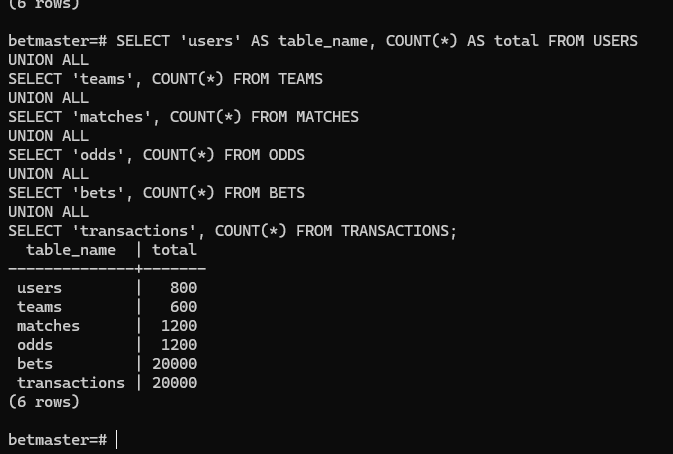

[פתיחת צילום כמות הרשומות](Screenshots/record_counts.png)

---

# בדיקת מפתחות זרים

לאחר ייבוא קבצי ה-CSV ל-PostgreSQL, נבדקו קשרי המפתחות הזרים.

הבדיקה אימתה כי:

- כל הימור מפנה למשתמש קיים.
- כל הימור מפנה למשחק קיים.
- כל עסקה מפנה למשתמש קיים.
- כל רשומת יחסי הימורים מפנה למשחק קיים.
- כל משחק מפנה לקבוצות קיימות.
- אין משחק שבו אותה קבוצה היא גם קבוצת בית וגם קבוצת חוץ.

כל בדיקות האימות החזירו:

```text
0 invalid records
```

תוצאה זו מאשרת שהנתונים שנוצרו עומדים בקשרי בסיס הנתונים ובאילוצי המפתחות הזרים.

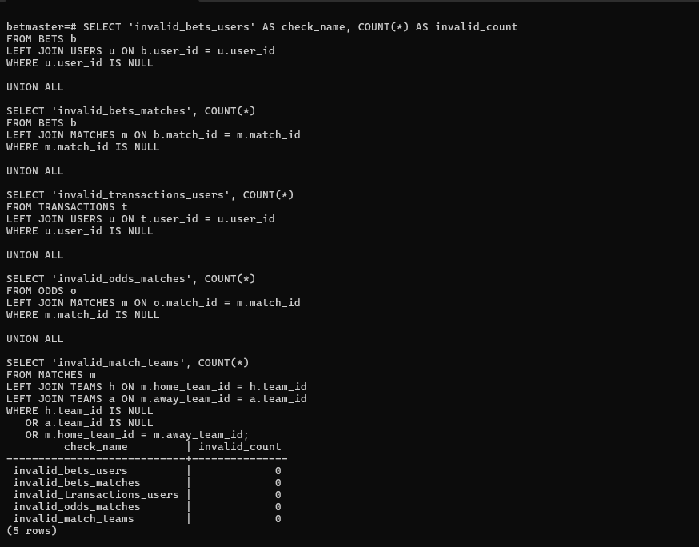

[פתיחת צילום בדיקת מפתחות זרים](Screenshots/fk_validation.png)

---

# גיבוי ושחזור

מומשו שתי שיטות גיבוי.

---

## שיטת גיבוי 1 - גיבוי SQL לוגי

נוצר גיבוי SQL לוגי של בסיס הנתונים באמצעות `pg_dump`.

קובץ:

- [backup_2026-05-01.sql](backup_2026-05-01.sql)

גיבוי זה מכיל את מבנה בסיס הנתונים ואת הנתונים בפורמט SQL.

ניתן לשחזר אותו לתוך בסיס נתונים אחר של PostgreSQL.

---

## שיטת גיבוי 2 - גיבוי פיזי של Docker Volume

נוצר גיבוי נוסף על ידי גיבוי ה-Docker volume של PostgreSQL עצמו.

קובץ:

- [backup_volume_2026-05-01.tar.gz](backup_volume_2026-05-01.tar.gz)

גיבוי זה שומר את התוכן הפיזי של אחסון בסיס הנתונים של PostgreSQL בפורמט דחוס.

---

## בדיקת שחזור

הגיבוי הלוגי נבדק על ידי שחזור בסיס הנתונים לתוך בסיס נתונים נפרד בשם:

```text
betmaster_restore
```

לאחר תהליך השחזור, הנתונים אומתו בהצלחה.

בסיס הנתונים ששוחזר הכיל את אותן כמויות רשומות כמו בסיס הנתונים המקורי:

| טבלה | מספר רשומות |
|---|---:|
| `USERS` | 800 |
| `TEAMS` | 600 |
| `MATCHES` | 1,200 |
| `ODDS` | 1,200 |
| `BETS` | 20,000 |
| `TRANSACTIONS` | 20,000 |

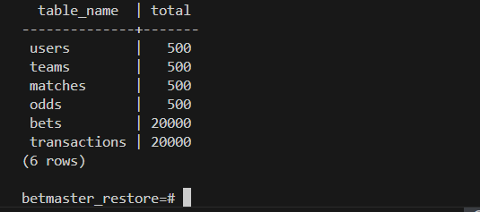

[פתיחת צילום אימות שחזור](Screenshots/restore_counts.png)

---

# צילומי מסך

## יצירת טבלאות

צילום זה מראה ששש טבלאות בסיס הנתונים הנדרשות נוצרו בהצלחה.

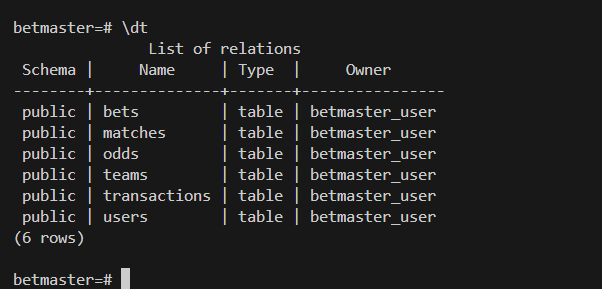

[פתיחת צילום יצירת טבלאות](Screenshots/tables_created.png)

---

## כמות רשומות

צילום זה מראה את כמות הרשומות הסופית בכל טבלה.


[פתיחת צילום כמות רשומות](Screenshots/record_counts.png)

---

## בדיקת מפתחות זרים

צילום זה מראה שכל בדיקות המפתחות הזרים החזירו אפס רשומות לא תקינות.


[פתיחת צילום בדיקת מפתחות זרים](Screenshots/fk_validation.png)

---

## קבצי גיבוי

צילום זה מראה את קבצי הגיבוי המעודכנים:

- `backup_2026-05-01.sql`
- `backup_volume_2026-05-01.tar.gz`

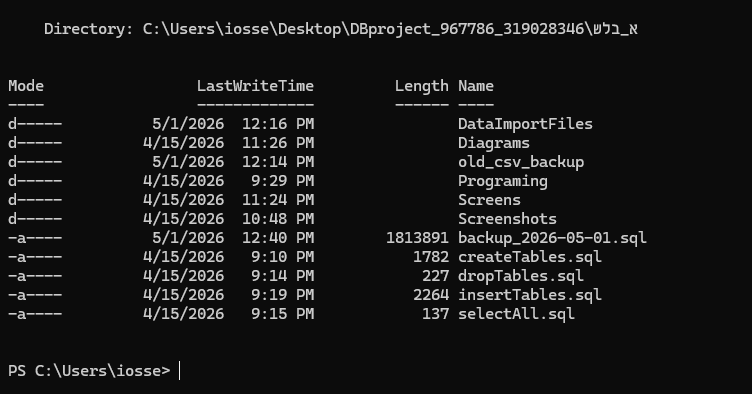

[פתיחת צילום קבצי גיבוי](Screenshots/backup_files.png)

---

## אימות שחזור

צילום זה מראה שהגיבוי שוחזר בהצלחה לתוך `betmaster_restore`.


[פתיחת צילום אימות שחזור](Screenshots/restore_counts.png)

---

# מבנה קבצי הפרויקט

הקבצים המרכזיים של שלב א' מאורגנים כך:

```text
שלב_א
│
├── DataImportFiles
│   ├── users.csv
│   ├── teams.csv
│   ├── matches.csv
│   ├── odds.csv
│   ├── bets.csv
│   └── transactions.csv
│
├── Diagrams
│   ├── ERD.png
│   └── DSD.png
│
├── Programming
│   └── generate_data.py
│
├── Screens
│   ├── screen1.png
│   ├── screen2.png
│   ├── screen3.png
│   └── screen4.png
│
├── Screenshots
│   ├── tables_created.png
│   ├── record_counts.png
│   ├── fk_validation.png
│   ├── backup_files.png
│   └── restore_counts.png
│
├── createTables.sql
├── dropTables.sql
├── insertTables.sql
├── selectAll.sql
├── backup_2026-05-01.sql
├── backup_volume_2026-05-01.tar.gz
└── README.md
```

---

# סיכום

המערכת שתוכננה מספקת בסיס ברור ומאורגן לניהול בסיס נתונים של הימורי כדורגל.

הפרויקט כולל ארבעה מסכי מערכת, שש ישויות בסיס נתונים מרכזיות, תרשימי ERD ו-DSD, קבצי מימוש SQL, נתונים שנוצרו, ייבוא CSV, קבצי גיבוי ואימות שחזור.

תהליך יצירת הנתונים שופר באמצעות שימוש בספריית `Faker` כדי ליצור שמות וערכים ריאליים.

בנוסף, הנתונים שנוצרו אומתו כדי לוודא שכל קשרי המפתחות הזרים נשמרים.

בסיס הנתונים אוכלס בהצלחה, גובה בשתי שיטות שונות, שוחזר לבסיס נתונים נפרד ואומת באמצעות בדיקות כמות רשומות.
