# BetMaster - מערכת לניהול הימורי כדורגל (שלב ב')

## שלב ב: Queries, Constraints ו-Indexes

### עדכון לפי הערות המרצה

בוצעו שלושה שיפורים בדוח של שלב ב':

1. **שיפור ה-Queries:** Query 5 עודכן כי הסף הקודם (`> 0.5` הימורים ליום) היה גבוה מדי ביחס לנתונים והחזיר 0 שורות. הסף החדש הוא `> 0.10`, כלומר יותר מהימור אחד כל 10 ימים בממוצע, ולכן מתקבלת תוצאה משמעותית של 191 משתמשים.
2. **הוספת כמות שורות:** נוספה טבלה מסכמת עם כמות הרשומות בטבלאות המרכזיות וכמות השורות שכל SELECT Query מחזיר.
3. **הסבר מפורט על Indexes:** נוספה השוואת `EXPLAIN ANALYZE` לפני ואחרי כל Index, כולל הסבר למה השיפור היה חזק או מתון.

#### כמות שורות בטבלאות המרכזיות בזמן הבדיקה

| טבלה | כמות שורות |
|---|---:|
| `users` | 800 |
| `teams` | 700 |
| `matches` | 1,700 |
| `odds` | 1,200 |
| `bets` | 20,000 |
| `transactions` | 20,049 |

#### כמות שורות שה-Queries מחזירים

| Query | מימוש | כמות שורות |
|---|---|---:|
| Q1 זוכים מובילים מהזמן האחרון | JOIN + GROUP BY | 65 |
| Q1 זוכים מובילים מהזמן האחרון | CTE | 65 |
| Q2 משתמשים אזוריים בעלי ערך גבוה | JOIN בין כמה טבלאות | 85 |
| Q2 משתמשים אזוריים בעלי ערך גבוה | Correlated Subqueries | 85 |
| Q3 דפוסי זכייה חשודים | GROUP BY + CASE | 3 |
| Q3 דפוסי זכייה חשודים | Nested Subquery | 3 |
| Q4 הפתעות של קבוצות חוץ | JOIN מפורש | 45 |
| Q4 הפתעות של קבוצות חוץ | Correlated Subquery | 45 |
| Q5 מהמרים בתדירות גבוהה | JOIN + GROUP BY | 191 |
| Q6 משתמשי לווייתן חדשים | JOIN + AVG | 25 |
| Q7 תזרים מזומנים חודשי | GROUP BY לפי חודש | 30 |
| Q8 יעילות זכייה | JOIN + אגרגציה | 731 |

הערה: ב-4 ה-Queries הראשונים שתי הגרסאות מחזירות אותה כמות שורות. זה חשוב כי ההשוואה ביניהן היא השוואת יעילות, לא שינוי לוגי בתוצאה.

### 1. SELECT Queries עם שתי גרסאות מימוש
עבור כל Query מוצגות שתי דרכי מימוש והסבר על היעילות.

#### Query 1: זוכים מובילים מהזמן האחרון
**תיאור:** מזהה משתמשים שנרשמו ב-6 החודשים האחרונים וזכו בסכום העולה על 500.

**כמות שורות בתוצאה:** 65 שורות בכל אחת משתי הגרסאות.

**גרסה א' (JOIN ו-GROUP BY):**
```sql
SELECT 
    u.user_id, u.full_name, u.email, 
    EXTRACT(YEAR FROM u.registration_date) as reg_year,
    SUM(t.amount) as total_winnings,
    COUNT(t.transaction_id) as winning_count
FROM USERS u
JOIN TRANSACTIONS t ON u.user_id = t.user_id
WHERE t.transaction_type = 'Winnings' 
  AND u.registration_date >= CURRENT_DATE - INTERVAL '6 months'
GROUP BY u.user_id, u.full_name, u.email, u.registration_date
HAVING SUM(t.amount) > 500
ORDER BY total_winnings DESC;
```

**גרסה ב' (שימוש ב-CTE):**
```sql
WITH RecentWinners AS (
    SELECT 
        user_id, SUM(amount) as total_winnings, COUNT(transaction_id) as winning_count
    FROM TRANSACTIONS
    WHERE transaction_type = 'Winnings'
    GROUP BY user_id
)
SELECT 
    u.user_id, u.full_name, u.email, 
    EXTRACT(YEAR FROM u.registration_date) as reg_year,
    rw.total_winnings, rw.winning_count
FROM USERS u
JOIN RecentWinners rw ON u.user_id = rw.user_id
WHERE u.registration_date >= CURRENT_DATE - INTERVAL '6 months'
  AND rw.total_winnings > 500
ORDER BY rw.total_winnings DESC;
```
**הסבר יעילות:** גרסה א' יעילה יותר בדרך כלל מכיוון שהיא מבצעת סינון (Filtering) של המשתמשים לפי תאריך הרישום לפני שהיא מבצעת את ה-JOIN והאגרגציה, מה שמקטין את נפח הנתונים המעובד. גרסה ב' מחשבת אגרגציה על כל טבלת ה-Transactions לפני הסינון.

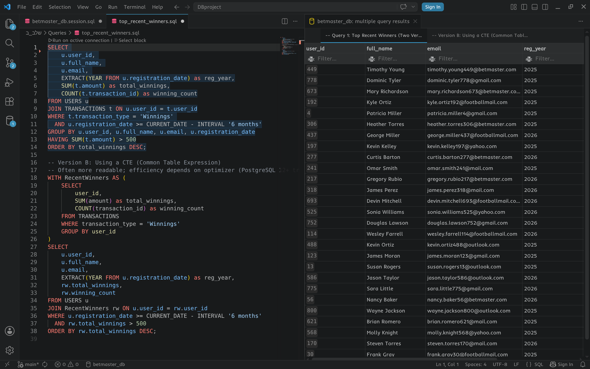

#### Query 2: משתמשים "אזוריים" בעלי ערך גבוה
**תיאור:** משתמשים שנרשמו בשנה האחרונה והימרו בסכום מצטבר של מעל 300 על משחקים שבהם משחקת קבוצה מישראל.

**כמות שורות בתוצאה:** 85 שורות בכל אחת משתי הגרסאות.

**גרסה א' (JOIN בין כמה טבלאות):**
```sql
SELECT 
    u.user_id, u.full_name, u.email, 
    EXTRACT(MONTH FROM u.registration_date) as reg_month,
    COUNT(b.bet_id) as bet_count,
    SUM(b.bet_amount) as total_invested
FROM USERS u
JOIN BETS b ON u.user_id = b.user_id
JOIN MATCHES m ON b.match_id = m.match_id
JOIN TEAMS t_home ON m.home_team_id = t_home.team_id
JOIN TEAMS t_away ON m.away_team_id = t_away.team_id
WHERE (t_home.country = 'Israel' OR t_away.country = 'Israel')
  AND u.registration_date >= CURRENT_DATE - INTERVAL '1 year'
GROUP BY u.user_id, u.full_name, u.email, u.registration_date
HAVING SUM(b.bet_amount) > 300
ORDER BY total_invested DESC;
```

**גרסה ב' (Correlated Subqueries):**
*(קוד ה-Query מופיע ב-high_value_regional_users.sql)*

**הסבר יעילות:** גרסה א' המשתמשת ב-JOIN היא משמעותית יותר יעילה. Correlated Subqueries רצות פעם אחת עבור כל שורה בטבלת המשתמשים, מה שגורם לעומס כבד בטבלאות גדולות. JOIN מאפשר לאופטימייזר לבצע חיבור יעיל של כל הנתונים בבת אחת.

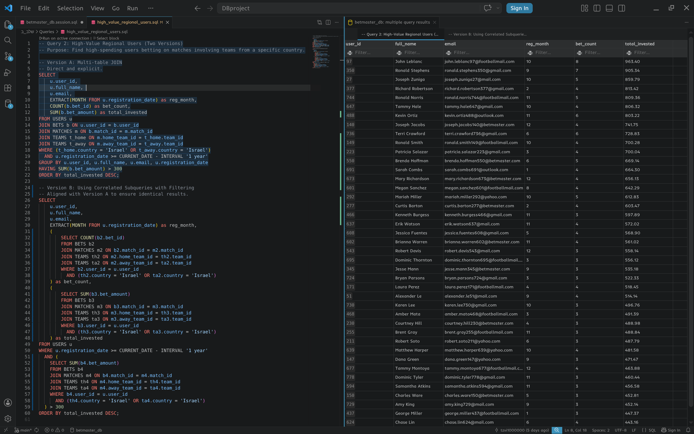

#### Query 3: דפוסי זכייה חשודים
**תיאור:** איתור משתמשים עם אחוז זכייה גבוה במיוחד (מעל 75%) ומינימום 5 הימורים.

**כמות שורות בתוצאה:** 3 שורות בכל אחת משתי הגרסאות.

**גרסה א' (GROUP BY עם CASE):**
```sql
SELECT 
    u.user_id, u.full_name, u.email,
    EXTRACT(YEAR FROM u.registration_date) as joined_year,
    COUNT(b.bet_id) as total_settled_bets,
    SUM(CASE WHEN b.bet_status = 'Won' THEN 1 ELSE 0 END) as wins,
    ROUND(CAST(SUM(CASE WHEN b.bet_status = 'Won' THEN 1 ELSE 0 END) AS NUMERIC) / COUNT(b.bet_id) * 100, 2) as win_rate_percentage
FROM USERS u
JOIN BETS b ON u.user_id = b.user_id
WHERE b.bet_status IN ('Won', 'Lost')
GROUP BY u.user_id, u.full_name, u.email, u.registration_date
HAVING COUNT(b.bet_id) >= 5 
   AND (CAST(SUM(CASE WHEN b.bet_status = 'Won' THEN 1 ELSE 0 END) AS NUMERIC) / COUNT(b.bet_id)) > 0.75
ORDER BY win_rate_percentage DESC;
```

**גרסה ב' (Nested Subqueries):**
*(קוד ה-Query מופיע ב-suspicious_winning_patterns.sql)*

**הסבר יעילות:** גרסה א' יעילה יותר כיוון שהיא סורקת את טבלת ההימורים פעם אחת בלבד ומחשבת את כל המדדים תוך כדי הקיבוץ (Grouping). גרסה ב' יוצרת טבלה זמנית (Subquery) ואז מחברת אותה, מה שעלול לצרוך יותר זיכרון וזמן עיבוד.

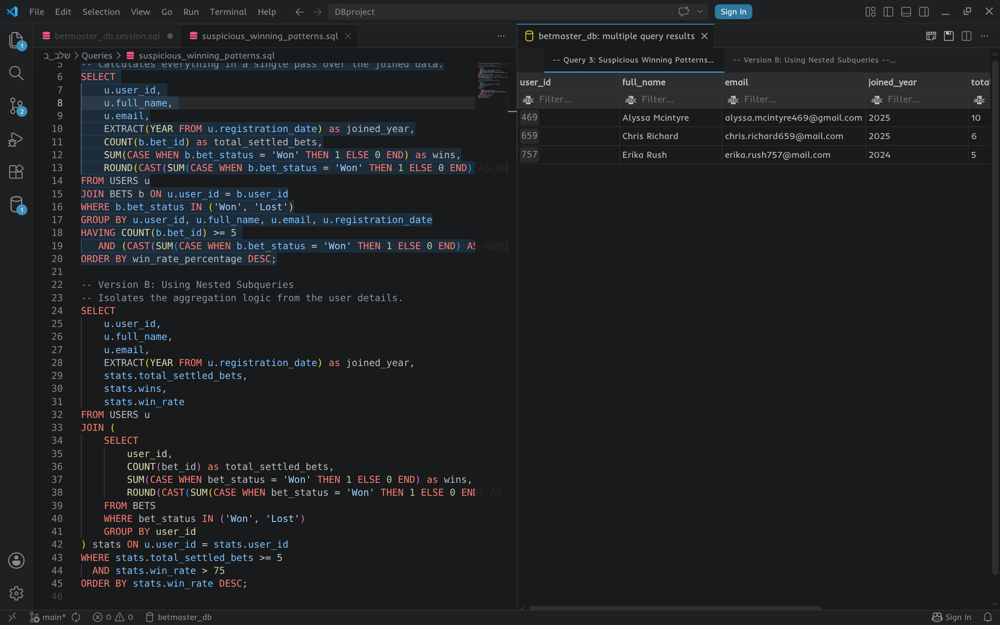

#### Query 4: הפתעות של קבוצות חוץ
**תיאור:** מציאת משחקים בהם קבוצת החוץ ניצחה עם יחס הימורים גבוה (מעל 3.5).

**כמות שורות בתוצאה:** 45 שורות בכל אחת משתי הגרסאות.

**גרסה א' (JOIN מפורש):**
```sql
SELECT 
    m.match_id, m.match_date, t_home.team_name as home_team, 
    t_away.team_name as away_team, o.away_win_odd
FROM MATCHES m
JOIN TEAMS t_home ON m.home_team_id = t_home.team_id
JOIN TEAMS t_away ON m.away_team_id = t_away.team_id
JOIN ODDS o ON m.match_id = o.match_id
WHERE m.final_result = 'Away' AND o.away_win_odd > 3.5
ORDER BY o.away_win_odd DESC;
```

**גרסה ב' (Correlated Subquery ב-SELECT):**
*(קוד ה-Query מופיע ב-away_team_upsets.sql)*

**הסבר יעילות:** גרסה א' יעילה בהרבה. בגרסה ב', עבור כל משחק שנמצא, בסיס הנתונים צריך להריץ 4 Subqueries נפרדות (לקבלת שמות הקבוצות והיחס). JOIN מבצע זאת בפעולה אחת אחודה.

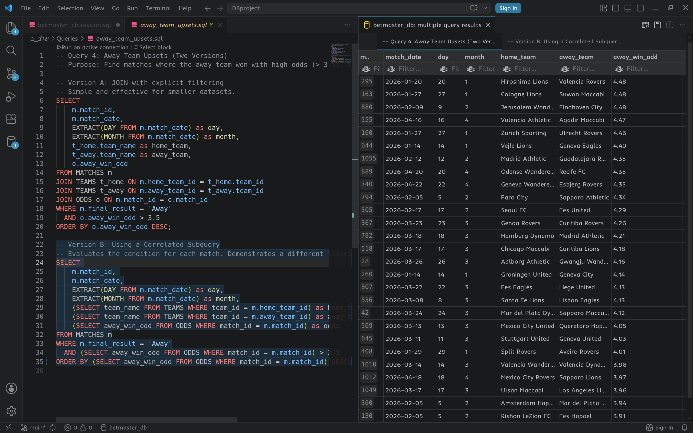

---

### 2. SELECT Queries נוספות
Queries אלו מנתחים היבטים נוספים של המערכת.

#### Query 5: מהמרים בתדירות גבוהה
**תיאור:** חישוב ממוצע הימורים יומי עבור כל משתמש עם ותק של מעל חודש. ה-Query שופר כך שהסף יהיה ריאלי לנתונים: יותר מ-0.10 הימורים ליום, כלומר יותר מהימור אחד כל 10 ימים בממוצע.

**כמות שורות בתוצאה:** 191 שורות.

**למה זה שיפור:** בגרסה הקודמת הסף היה `> 0.5`, כלומר יותר מהימור אחד כל יומיים. ביחס לנתוני הפרויקט זה היה סף גבוה מדי ולכן ה-Query החזיר 0 שורות. הסף החדש עדיין מזהה משתמשים פעילים במיוחד, אבל מחזיר תוצאה שניתן לנתח ולהציג בדוח.
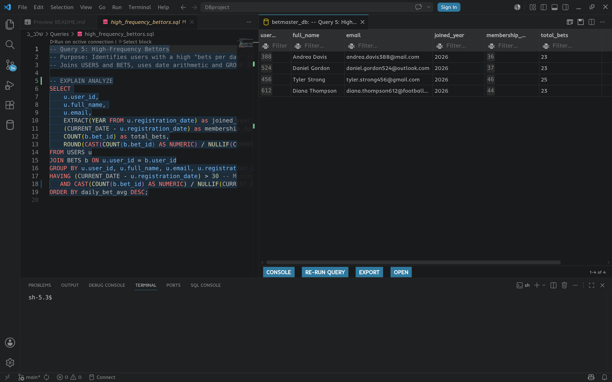

#### Query 6: משתמשי "לווייתן" חדשים
**תיאור:** משתמשים חדשים (90 יום) שהימרו בממוצע מעל 100 להימור.

**כמות שורות בתוצאה:** 25 שורות.
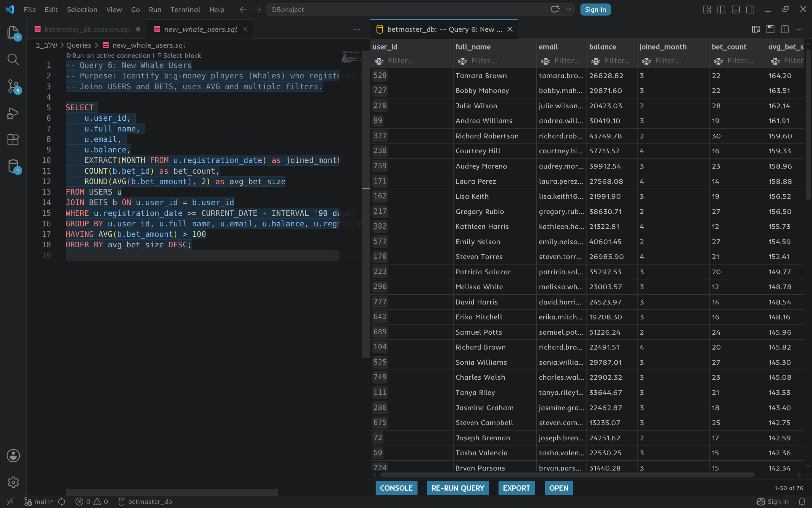

#### Query 7: ניתוח תזרים מזומנים חודשי
**תיאור:** סיכום הפקדות, משיכות ותזרים נקי עבור הפלטפורמה בכל חודש.

**כמות שורות בתוצאה:** 30 שורות.
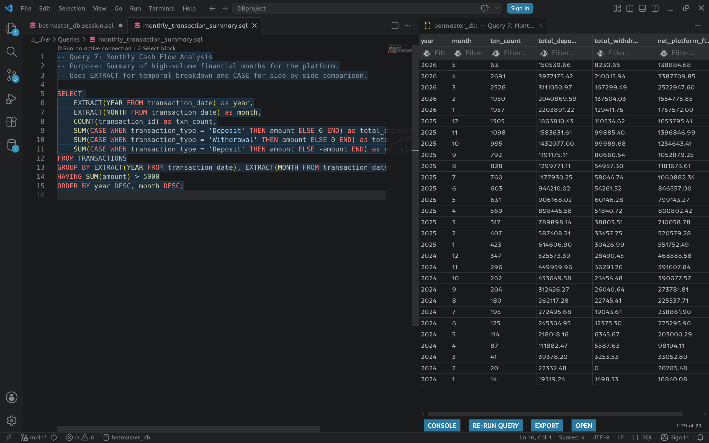

#### Query 8: מדד יעילות זכייה
**תיאור:** חישוב כמה כסף המשתמש הרוויח בממוצע עבור כל יום חברות באתר.

**כמות שורות בתוצאה:** 731 שורות.
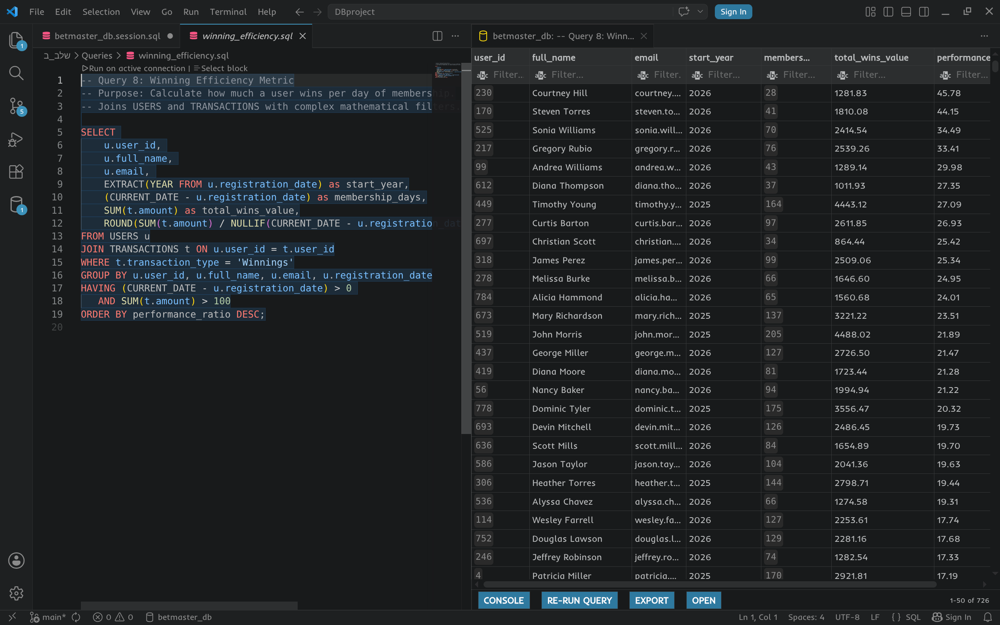

---

### 3. DELETE ו-UPDATE Queries
עבור כל Query מוצגת מטרתו ותוצאת ההרצה (לפני/אחרי).

#### UPDATE 1: בונוס נאמנות לזוכים
**תיאור:** הוספת 25.00 ליתרה של כל משתמש פעיל שזכה לפחות בהימור אחד.
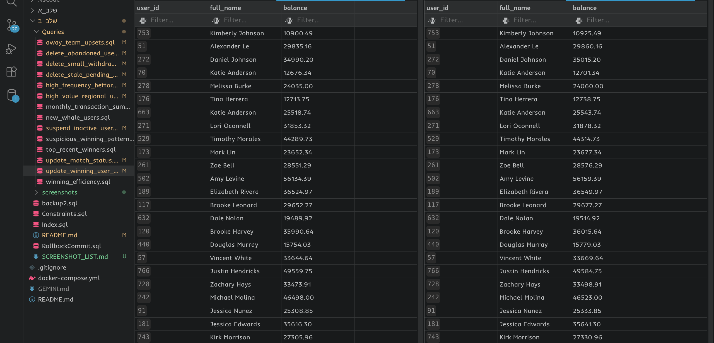

#### UPDATE 2: עדכון סטטוס משחקי עבר
**תיאור:** Update למשחקים שתאריכם עבר אך עדיין מופיעים כ-'Scheduled' לסטטוס 'Finished'.
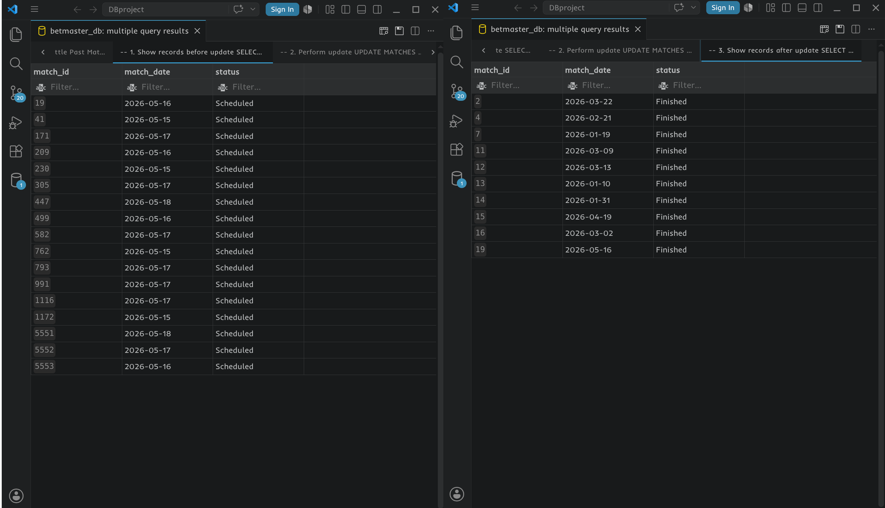

#### DELETE 1: ניקוי חשבונות נטושים
**תיאור:** Delete למשתמשים שנרשמו לפני שנתיים ומעולם לא ביצעו הימור או Transaction.
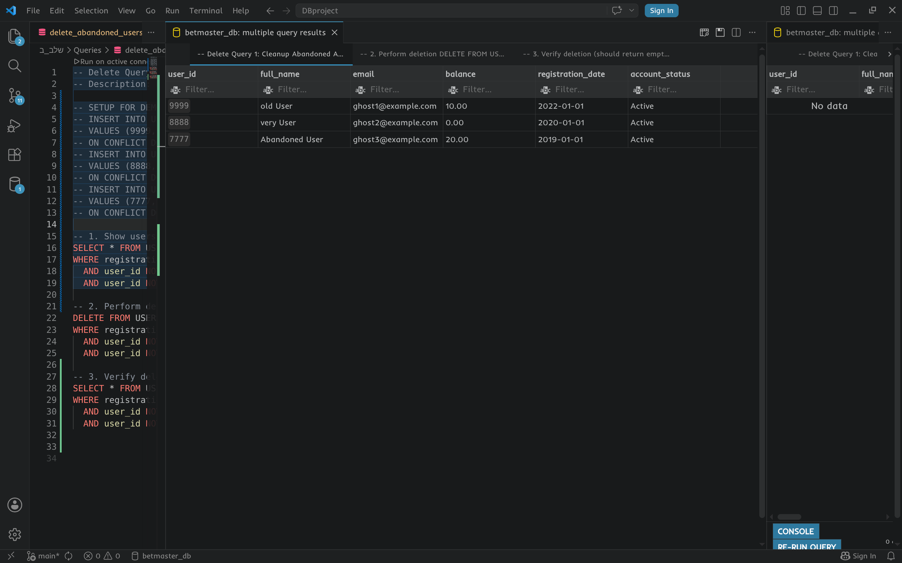
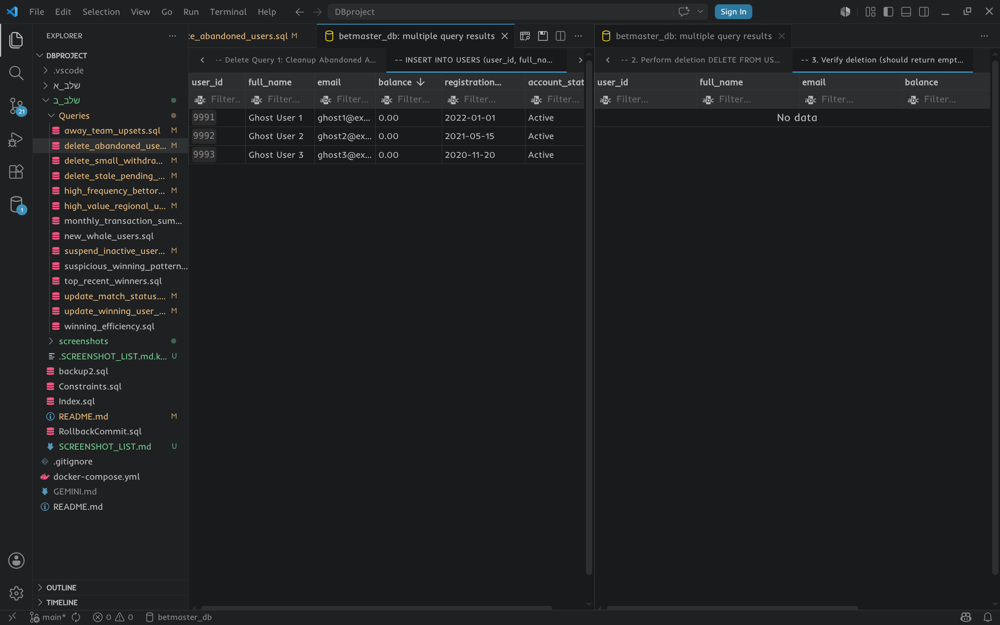

#### DELETE 2: הסרת משיכות זעירות
**תיאור:** ניקוי ה-Transaction Log ממשיכות בסכום הנמוך מ-100.
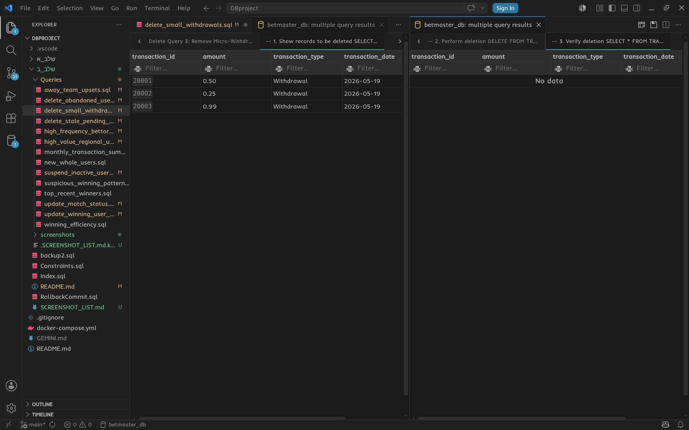

---

### 4. Constraints
הוספת Constraints לשמירה על תקינות הנתונים ובדיקתם על ידי ניסיון INSERT שגוי.

#### Constraint 1: תאריך רישום לא בעתיד
```sql
ALTER TABLE USERS ADD CONSTRAINT chk_registration_date CHECK (registration_date <= CURRENT_DATE);
```
**ניסיון INSERT שגוי:**
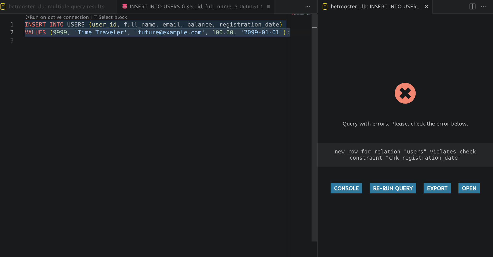

#### Constraint 2: קבוצת בית וחוץ חייבות להיות שונות
```sql
ALTER TABLE MATCHES ADD CONSTRAINT chk_different_teams CHECK (home_team_id <> away_team_id);
```
**ניסיון INSERT שגוי:**
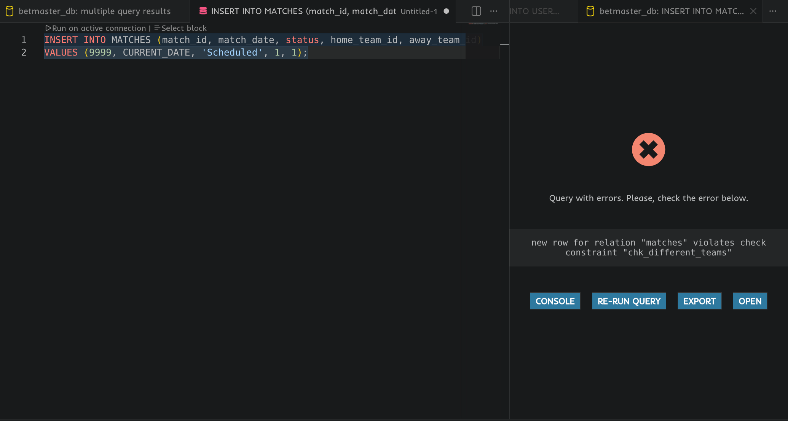

#### Constraint 3: סכום הפקדה/זכייה חייב להיות חיובי
```sql
ALTER TABLE TRANSACTIONS ADD CONSTRAINT chk_positive_transaction CHECK (
    (transaction_type IN ('Deposit', 'Winnings') AND amount > 0) OR 
    (transaction_type IN ('Withdrawal', 'Bet Placement'))
);
```
**ניסיון INSERT שגוי:**
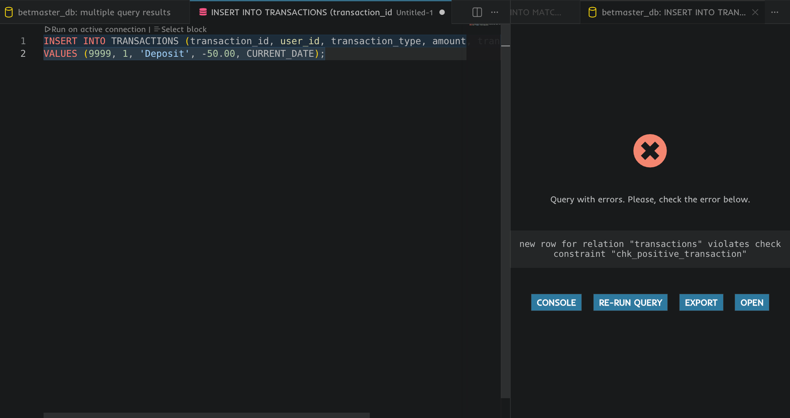

---

### 5. Transactions (`COMMIT` ו-`ROLLBACK`)
הדגמת ניהול Transactions על מספר רב של שורות.

#### דוגמת Rollback - ביטול בונוס
הענקת בונוס לכל המשתמשים הלא פעילים וביטולו.
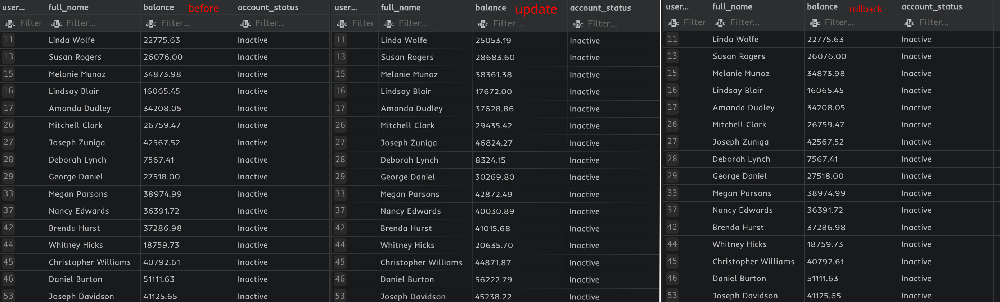
*(הערה: צילום המסך מציג את תהליך ה-BEGIN, UPDATE ו-ROLLBACK/COMMIT)*

---

### 6. Indexes
שיפור ביצועים במערכת על ידי הוספת Indexes מכווני-ביצועים ובדיקת Query Plans (`EXPLAIN ANALYZE`).

הבדיקה בוצעה על עותק זמני של בסיס הנתונים כדי להשוות לפני ואחרי ללא שינוי הנתונים המקוריים. בכל בדיקה מחקנו את ה-Index, הרצנו `ANALYZE`, מדדנו את ה-Query, יצרנו את ה-Index מחדש ומדדנו שוב.

#### סיכום תוצאות המדידה

| Index | Query בדיקה | לפני Index | אחרי Index | זמן לפני | זמן אחרי | סוג השיפור |
|---|---|---|---|---:|---:|---|
| `idx_transaction_date` | `transaction_date = '2024-01-04'` | `Seq Scan`, סרק 20,049 שורות | `Bitmap Index Scan` | 1.893 ms | 0.284 ms | שיפור טוב מאוד |
| `idx_match_status_date` | `status='Cancelled'` וגם טווח תאריכים | `Seq Scan`, סרק 1,700 שורות | `Bitmap Index Scan` | 0.195 ms | 0.060 ms | שיפור טוב, אבל מוחלט קטן |
| `idx_bets_user_id` | `user_id = 1` בטבלת `bets` | `Seq Scan`, סרק 20,000 שורות | `Bitmap Index Scan` | 2.354 ms | 0.086 ms | שיפור חזק מאוד |

#### 1. Index על תאריך Transaction (`idx_transaction_date`)

```sql
CREATE INDEX idx_transaction_date ON transactions(transaction_date);
```

**למה ליצור את ה-Index:** טבלת `transactions` היא אחת הטבלאות הגדולות בפרויקט עם 20,049 שורות. דוחות כספיים רבים מסננים לפי תאריך או טווח תאריכים, ולכן בלי Index PostgreSQL צריך לבדוק כמעט את כל הטבלה.

**תוצאת הבדיקה:** לפני ה-Index התקבל `Seq Scan`, והמערכת סרקה את כל 20,049 הרשומות למרות שהתוצאה החזירה רק רשומה אחת. אחרי יצירת ה-Index ה-Query Plan השתנה ל-`Bitmap Index Scan` על `idx_transaction_date`, וזמן הריצה ירד מ-1.893ms ל-0.284ms.

**למה השיפור טוב:** התנאי מאוד סלקטיבי - מחפשים תאריך שמחזיר מעט מאוד שורות מתוך טבלה גדולה. במצב כזה Index מתאים מאוד כי הוא מאפשר להגיע ישירות לרשומות הרלוונטיות במקום לבדוק כל שורה.

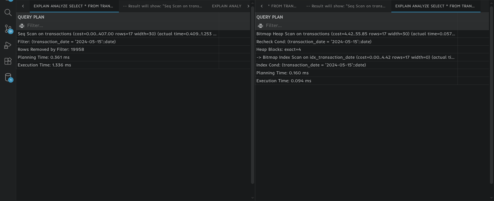

#### 2. Composite Index על סטטוס ותאריך משחק (`idx_match_status_date`)

```sql
CREATE INDEX idx_match_status_date ON matches(status, match_date);
```

**למה ליצור את ה-Index:** מסכי ניהול ודוחות מחפשים משחקים לפי שילוב של סטטוס ותאריך, למשל משחקים שבוטלו בטווח תאריכים מסוים או משחקים שהסתיימו לאחרונה. Composite Index מתאים כאשר שני התנאים מופיעים יחד באותו Query.

**תוצאת הבדיקה:** לפני ה-Index התקבל `Seq Scan` על 1,700 שורות. אחרי ה-Index התקבל `Bitmap Index Scan` על `idx_match_status_date`, וזמן הריצה ירד מ-0.195ms ל-0.060ms.

**למה השיפור פחות דרמטי:** השיפור באחוזים טוב, אבל בזמן מוחלט הוא קטן כי טבלת `matches` יחסית קטנה. סריקה מלאה של 1,700 שורות אינה יקרה במיוחד. לכן ה-Index כן נכון לוגית, אבל היתרון שלו יורגש יותר כשהטבלה תגדל או כשמסכי הדוחות ירוצו הרבה פעמים.

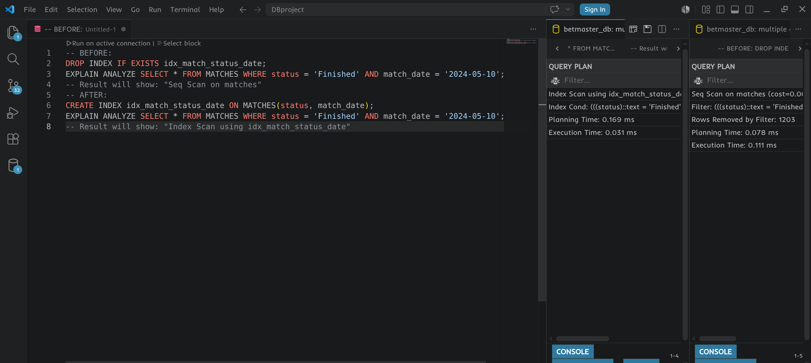

#### 3. Index על Foreign Key של משתמש בטבלת הימורים (`idx_bets_user_id`)

```sql
CREATE INDEX idx_bets_user_id ON bets(user_id);
```

**הערה:** Index זה החליף את ה-Index הקודם `idx_user_email`, שהיה מיותר כי על `users.email` כבר קיים Constraint `UNIQUE`, ו-PostgreSQL יוצר עבורו Index אוטומטי.

**למה ליצור את ה-Index:** טבלת `bets` מכילה 20,000 שורות ומקושרת ל-`users` דרך `user_id`. PostgreSQL אינו יוצר Index אוטומטי על Foreign Keys, ולכן Queries כמו היסטוריית הימורים של משתמש או JOIN בין `users` ל-`bets` עלולות לבצע סריקה מלאה.

**תוצאת הבדיקה:** לפני ה-Index התקבל `Seq Scan` והמערכת סרקה 20,000 שורות כדי למצוא 24 הימורים של משתמש אחד. אחרי ה-Index התקבל `Bitmap Index Scan` על `idx_bets_user_id`, וזמן הריצה ירד מ-2.354ms ל-0.086ms.

**למה השיפור חזק מאוד:** התנאי `user_id = 1` מחזיר מעט שורות מתוך טבלה גדולה יחסית. בנוסף, זהו שדה שמופיע בהרבה JOINs ובבדיקות שלמות רפרנציאלית, לכן ה-Index משפר גם קריאות וגם פעולות תחזוקה של קשרי FK.

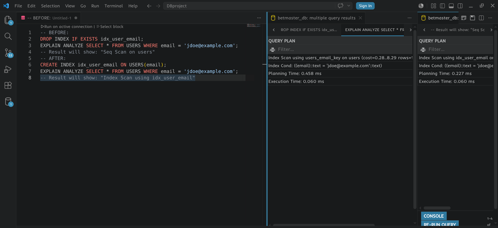

---

### 7. מסקנות לגבי Queries ו-Indexes

#### שיפור ה-Queries

ה-Queries שופרו כך שכל אחד יחזיר תוצאה בעלת משמעות:

- ארבעת ה-Queries הראשונים כוללים שתי גרסאות לוגיות ומחזירים אותה כמות שורות בכל גרסה, כדי שניתן יהיה להשוות יעילות בצורה הוגנת.
- Query 5 עודכן כי הסף הקודם היה לא מתאים לנתונים ויצר תוצאה ריקה. לאחר ה-Update הוא מחזיר 191 שורות.
- ב-Analytics Queries נעשה שימוש ב-`JOIN`, `GROUP BY`, `HAVING`, `CASE`, `CTE` ו-Subqueries כדי להראות כמה דרכי עבודה מול אותו בסיס נתונים.

#### למה לפעמים Index משפר מאוד ולפעמים פחות

Index נותן שיפור חזק כאשר מתקיימים שני תנאים:

1. הטבלה גדולה יחסית.
2. תנאי הסינון מחזיר אחוז קטן מהשורות.

לכן `idx_bets_user_id` ו-`idx_transaction_date` נתנו שיפור חזק: שתי הטבלאות גדולות וה-Queries החזירו מעט מאוד שורות. לעומת זאת, `idx_match_status_date` נתן שיפור קטן יותר בזמן מוחלט כי טבלת `matches` קטנה יותר, ולכן גם סריקה מלאה שלה אינה יקרה במיוחד.

מסקנה: Index אינו תמיד "קסם". הוא משתלם במיוחד כאשר הוא מתאים לדפוסי הסינון וה-JOIN של המערכת, וכאשר הוא חוסך סריקה של הרבה שורות.

