# Stage C - Integration and Views

## 1. Stage Goal

In Stage C, we integrated two different database systems into one combined database.

Our original system is **BetMaster**, a football betting management system. The received system is **Football Management System**, which manages football teams, matches, players, coaches, referees, stadiums, and match statistics.

The integration was done according to **Method A** from the assignment:

- Build the DSD of the received department from its backup.
- Reverse engineer the received DSD into an ERD.
- Design a shared integrated ERD.
- Convert the integrated ERD into a new relational schema.
- Modify the existing database using SQL commands instead of recreating all tables from scratch.
- Make sure the integrated database contains data from both systems.
- Run the previous Stage B queries on the integrated database.
- Create two required views, one for each original department, and two meaningful queries for each view.
- Create the final backup `backup3.sql`.

## 2. Submission Checklist

| Requirement | File / Evidence |
| --- | --- |
| DSD of the received department | `Diagrams/received_DSD.png` |
| ERD of the received department | `Diagrams/received_ERD.png` |
| Integrated ERD | `Diagrams/integrated_ERD.png` |
| DSD after integration | `Diagrams/integrated_DSD.png` |
| Table creation/change commands | `Integrate.sql` |
| Views and queries on views | `Views.sql` |
| Final updated backup | `backup3.sql` |
| Stage C report | `דוח הפרויקט שלב ג.md` |
| Screenshots and outputs | `screenshots/` |
| Integration validation output | `integration_validation_output.txt` |
| Stage B queries after integration | `stage_b_queries_on_integrated_output.txt` |

## 3. Received Department DSD

The received backup was restored and analyzed. From the tables, primary keys, foreign keys, and constraints, we built the DSD of the received department.

Main tables in the received system:

- `team`
- `match`
- `matchteam`
- `player`
- `goalkeeper`
- `playermatchstats`
- `coach`
- `coachedby`
- `referee`
- `refereeat`
- `stadium`
- `matchstadium`

**DSD of the received department:**

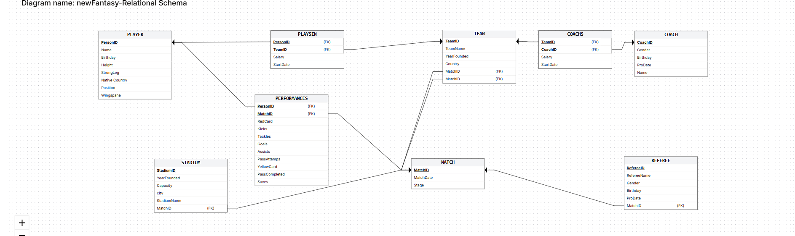

**How to read this image:** this diagram shows the physical table structure of
the received database before integration. It is used as evidence that we
restored and analyzed the other group's backup.

## 4. Received Department ERD

After building the DSD, we reverse engineered it into an ERD.

The main conceptual entities are:

- `Team`
- `Match`
- `Player`
- `Coach`
- `Referee`
- `Stadium`

Relationship tables such as `matchteam`, `coachedby`, `playsfor_player`, and `refereeat` were interpreted as conceptual relationships between entities.

**ERD of the received department:**

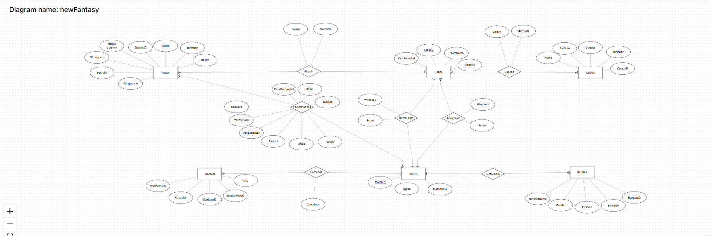

**How to read this image:** this diagram converts the received tables into
conceptual entities and relationships. It shows the reverse engineering result
for the received department.

## 5. Reverse Engineering Algorithm

The reverse engineering process from the received database schema to ERD was:

1. Restore the received backup.
2. List all tables in the restored database.
3. For each table, inspect columns, data types, nullability, and constraints.
4. Identify primary keys using `PRIMARY KEY` constraints.
5. Identify foreign keys using `FOREIGN KEY` constraints.
6. Treat tables with independent primary keys as strong entities.
7. Treat tables made mostly of foreign keys as relationship tables.
8. Treat tables whose primary key is also a foreign key as subtype or dependent entities.
9. Determine cardinalities based on foreign keys and uniqueness.
10. Convert the relational structure into a conceptual ERD.

## 6. Integration Design Decisions

The main integration decision was to connect both systems through the football entities that both systems share:

- `Team`
- `Match`

BetMaster already had:

- `teams`
- `matches`
- `users`
- `bets`
- `transactions`
- `odds`

The received system had football-management data around teams and matches:

- players
- coaches
- referees
- stadiums
- match statistics
- player contracts

### Main Integration Decisions

1. Received `team` records were inserted into the existing `teams` table.
2. Received `match` records were inserted into the existing `matches` table.
3. Existing tables were changed with `ALTER TABLE`; we did not recreate the full database from scratch.
4. New football-related tables were created only for entities that did not exist in BetMaster.
5. Mapping tables were created to preserve the relationship between received IDs and integrated IDs.
6. `source_system`, `received_team_id`, and `received_match_id` were added to preserve source information.
7. `teams.home_stadium_id` was added so each team can be linked to its home stadium.
8. If received teams had names that did not match BetMaster teams, they were kept as separate teams with source tracking.

## 7. Integrated ERD

The integrated ERD is the conceptual design of the combined system.

The center of the integrated ERD is:

- `Team`
- `Match`

The BetMaster side connects through bets, users, odds, and transactions. The Football Management side connects through players, coaches, referees, stadiums, and statistics.

**Integrated ERD:**

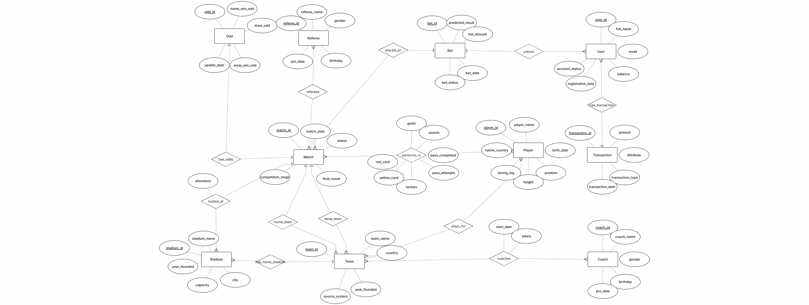

**How to read this image:** this is the conceptual design of the combined
system. `Team` and `Match` are the shared center, with BetMaster entities on
one side and Football Management entities on the other side.

## 8. DSD After Integration

The DSD after integration was generated from the integrated ERD in ERDPlus. It shows the relational schema that comes from the ERD design, including the main tables, keys, and relationships.

File:

```text
Diagrams/integrated_DSD_erdplus.png
```

**DSD generated by ERDPlus from the integrated ERD:**

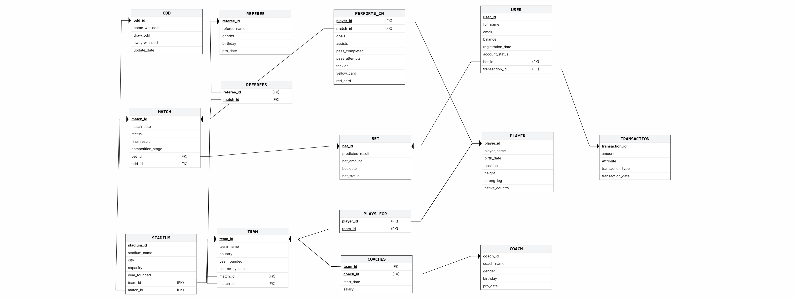

**How to read this image:** this is the relational schema generated from the
integrated ERD design. It shows the expected database structure according to the
ERDPlus conversion.

In addition, we kept a schema-based DSD that reflects the actual implemented database structure after running `Integrate.sql`:

```text
Diagrams/integrated_DSD.png
```

**Implemented relational schema DSD:**

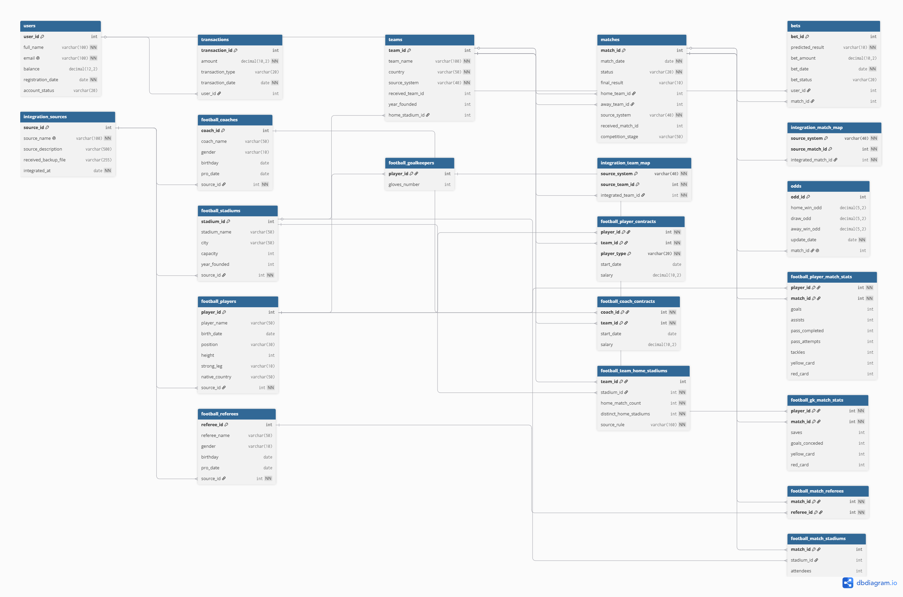

**How to read this image:** this diagram reflects the database that was
actually implemented by `Integrate.sql`. It includes implementation details
such as mapping tables and technical integration columns.

## 9. Why the ERDPlus DSD and Implemented DSD Are Not Identical

The integrated ERD was built in ERDPlus as a conceptual diagram. ERDPlus can also generate a relational schema from that ERD, and this generated DSD is included as `integrated_DSD_erdplus.png`.

However, the implemented DSD is based on the actual SQL schema created by `Integrate.sql` and saved in `backup3.sql`. Therefore, the implemented DSD may contain additional technical tables, mapping tables, and implementation details that are not shown the same way in the ERDPlus-generated schema.

This is expected: the ERDPlus DSD demonstrates the conversion from ERD to relational schema, while the implemented DSD demonstrates the real database structure after integration.

## 10. Integration SQL

The integration commands are in:

```text
Integrate.sql
```

This file performs the following actions:

1. Creates `integration_sources` to document data sources.
2. Extends existing `teams` and `matches` tables.
3. Creates mapping tables for received team IDs and match IDs.
4. Migrates received teams into `teams`.
5. Migrates received matches into `matches`.
6. Creates new football-management tables.
7. Migrates players, coaches, referees, stadiums, contracts, and statistics.
8. Connects teams to home stadiums.
9. Runs validation queries to verify row counts.

## 11. Integration Validation

After the integration, we verified that the combined database contains data in both the original BetMaster tables and the new football-management tables.

**Row count validation screenshot:**

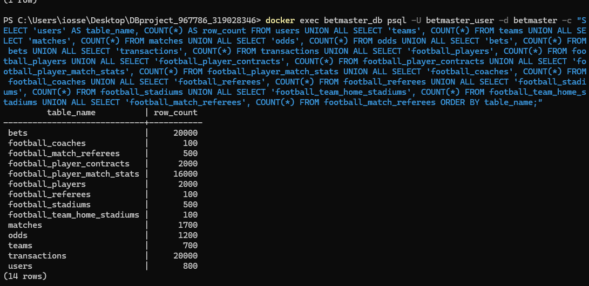

**What this screenshot proves:** the integrated database contains records from
both systems. BetMaster tables such as `users`, `bets`, `transactions`, and
`odds` still contain data, and the new `football_*` tables also contain data
from the received system.

Full validation output:

```text
integration_validation_output.txt
```

## 12. Running Stage B Queries After Integration

The assignment requires running the previous stage queries on the integrated database to make sure they still work.

We ran Stage B queries after the integration. The screenshot below shows the
`top_recent_winners.sql` query running on the integrated database and returning
recent users with high winnings.

**Example output:**

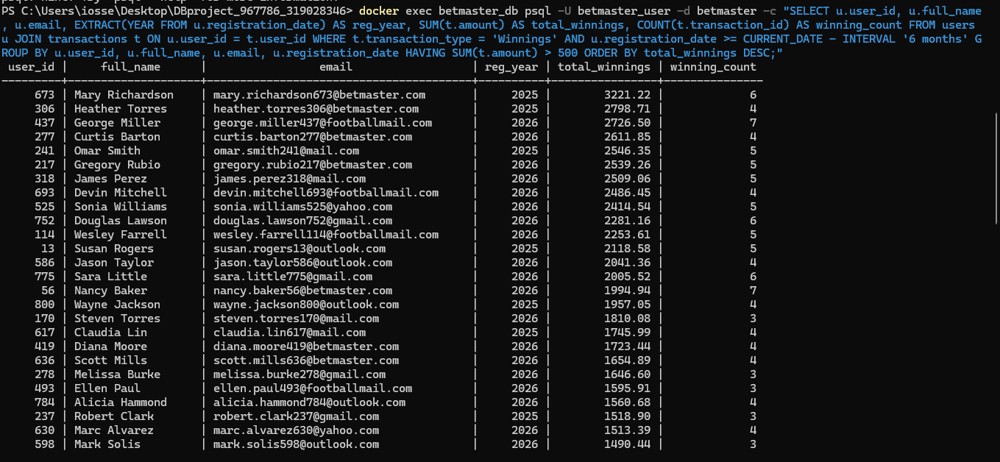

**What this screenshot proves:** a query from Stage B still runs successfully
after the integration. The output lists recent users with high winnings, so the
original BetMaster functionality was not broken by the integration.

Full output:

```text
stage_b_queries_on_integrated_output.txt
```

## 13. Views

The assignment requires two views:

1. one view from the original department point of view,
2. one view from the received department point of view.

We created the required two views and also created one additional integrated view.

## 14. View 1 - BetMaster Point of View

View name:

```text
vw_betmaster_user_activity
```

This view summarizes user activity in the betting system. It combines users, bets, and transactions. It is not a simple select from one table.

It includes:

- user details,
- total number of bets,
- total bet amount,
- won bets,
- lost bets,
- deposits,
- withdrawals,
- winnings.

### Select 10 Records

```sql
SELECT *
FROM vw_betmaster_user_activity
LIMIT 10;
```

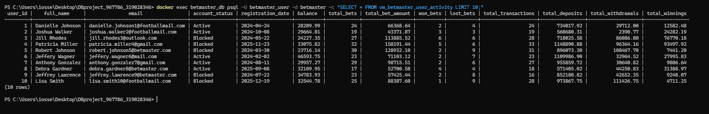

**What this screenshot shows:** 10 example rows from the BetMaster view. Each
row summarizes one user's betting and financial activity.

### Query 1 on BetMaster View

Purpose: find active users with high betting volume.

```sql
SELECT
    user_id,
    full_name,
    email,
    total_bets,
    total_bet_amount,
    balance
FROM vw_betmaster_user_activity
WHERE account_status = 'Active'
  AND total_bets >= 10
ORDER BY total_bet_amount DESC
LIMIT 10;
```

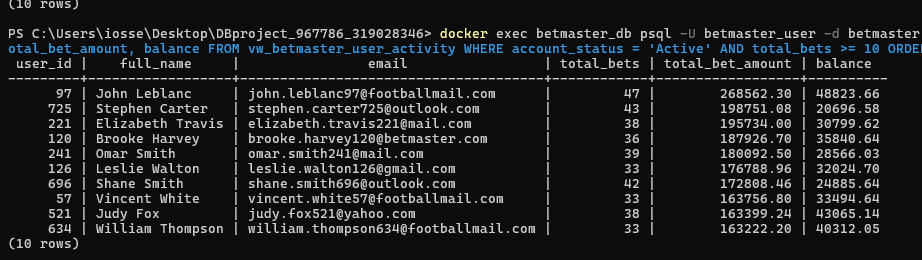

**What this screenshot shows:** active users with many bets, ordered by total
betting volume. This helps the betting department identify high-activity users.

### Query 2 on BetMaster View

Purpose: find users whose winnings are greater than their withdrawals.

```sql
SELECT
    user_id,
    full_name,
    total_winnings,
    total_withdrawals,
    total_winnings - total_withdrawals AS winnings_after_withdrawals
FROM vw_betmaster_user_activity
WHERE total_winnings > total_withdrawals
ORDER BY winnings_after_withdrawals DESC
LIMIT 10;
```

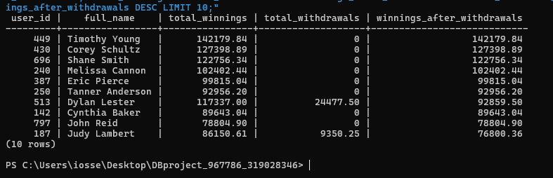

**What this screenshot shows:** users whose total winnings are greater than
their withdrawals. The calculated column shows the remaining difference between
winnings and withdrawals.

## 15. View 2 - Football Management Point of View

View name:

```text
vw_football_player_performance
```

This view summarizes football player performance. It joins players, teams, player contracts, and match statistics.

It includes:

- player details,
- team name,
- salary,
- number of matches played,
- goals,
- assists,
- yellow cards,
- red cards.

### Select 10 Records

```sql
SELECT *
FROM vw_football_player_performance
LIMIT 10;
```

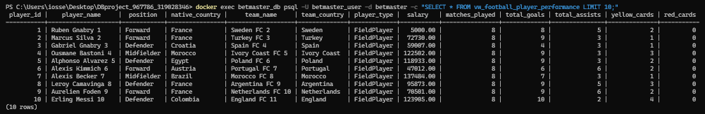

**What this screenshot shows:** 10 example rows from the Football Management
view. Each row summarizes one player's team, contract, and match performance.

### Query 1 on Football View

Purpose: find the most productive players by goals and assists.

```sql
SELECT
    player_id,
    player_name,
    team_name,
    total_goals,
    total_assists,
    total_goals + total_assists AS total_contributions
FROM vw_football_player_performance
WHERE matches_played > 0
ORDER BY total_contributions DESC, total_goals DESC
LIMIT 10;
```

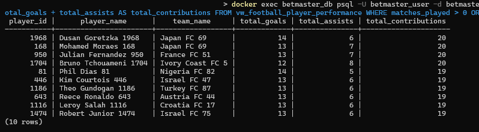

**What this screenshot shows:** the most productive players by total goal
contribution. The `total_contributions` column is calculated as goals plus
assists.

### Query 2 on Football View

Purpose: find high salary players with low goal contribution.

```sql
SELECT
    player_id,
    player_name,
    team_name,
    salary,
    matches_played,
    total_goals
FROM vw_football_player_performance
WHERE salary > 100000
  AND total_goals < 5
ORDER BY salary DESC
LIMIT 10;
```

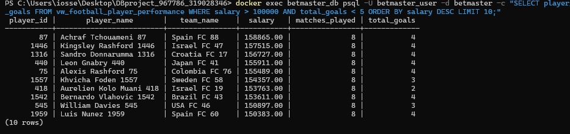

**What this screenshot shows:** high-salary players with low goal contribution.
The salary threshold is set to `100000` because this matches the salary scale in
the actual data.

## 16. Additional Integrated View

In addition to the required two views, we created an extra integrated view:

```text
vw_integrated_match_betting_context
```

This view combines match information with betting context, teams, stadiums,
attendance, and source system information. The screenshot uses a mixed sample:
BetMaster rows demonstrate betting activity, while FootballManagement rows
demonstrate stadium and attendance data.

```sql
WITH betmaster_examples AS (
    SELECT *
    FROM vw_integrated_match_betting_context
    WHERE source_system = 'BetMaster'
      AND total_bet_amount > 0
    ORDER BY total_bet_amount DESC
    LIMIT 5
), football_examples AS (
    SELECT *
    FROM vw_integrated_match_betting_context
    WHERE source_system = 'FootballManagement'
      AND attendees IS NOT NULL
    ORDER BY attendees DESC
    LIMIT 5
)
SELECT *
FROM betmaster_examples
UNION ALL
SELECT *
FROM football_examples
ORDER BY source_system, total_bet_amount DESC, attendees DESC;
```

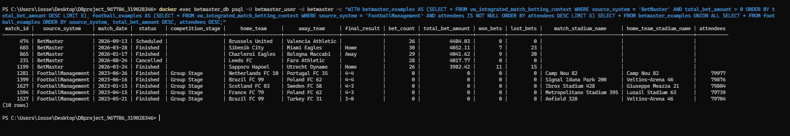

**What this screenshot shows:** a mixed sample from the integrated view. The
BetMaster rows show betting activity, while the FootballManagement rows show
stadium and attendance data. Empty stadium columns in BetMaster rows are
expected because the original betting system did not store stadium information.
Zero betting columns in FootballManagement rows are also expected because the
received system did not store bets.

## 17. Final Backup

The final integrated backup is:

```text
backup3.sql
```

This backup was created after:

1. restoring both systems,
2. running the integration script,
3. creating the views,
4. validating the data,
5. running Stage B queries successfully.

## 18. Final Execution Order

The actual execution order was:

1. Restore our Stage B backup.
2. Restore the received backup.
3. Run `Integrate.sql`.
4. Run `Views.sql`.
5. Validate row counts.
6. Run Stage B queries on the integrated database.
7. Generate `backup3.sql`.

## 19. Summary

The final integrated database contains data from both original systems. The integration keeps the original BetMaster betting functionality and adds football-management information such as players, coaches, referees, stadiums, and performance statistics.

The required diagrams, SQL scripts, views, queries, outputs, report, and final backup are all included in this folder.

