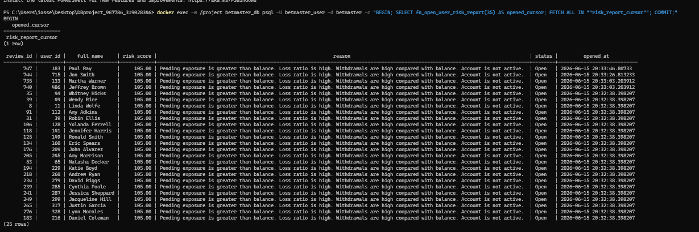
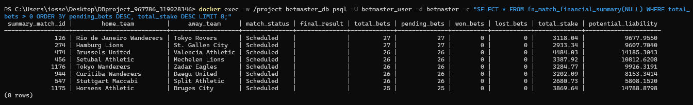
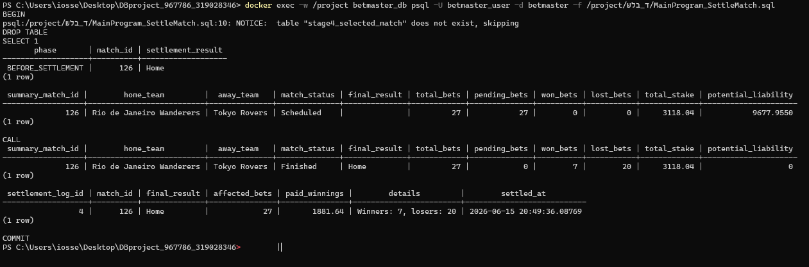
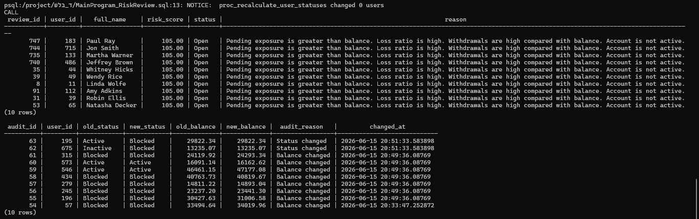
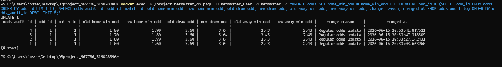
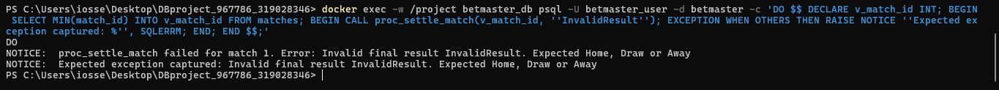

# Stage D - PL/pgSQL Programming

This folder contains the Stage D submission for the integrated BetMaster
database. In this stage we wrote PL/pgSQL programs that work on the expanded
database from Stage C and demonstrate real database logic, not only simple
`SELECT` queries.

The main idea of the stage is to use the betting system as an operational
system:

- identify risky users,
- summarize financial exposure on matches,
- settle matches and pay winnings,
- audit important updates,
- prove that exceptions are handled correctly.

## 1. Why These Programs Were Chosen

The integrated database contains betting tables (`users`, `bets`,
`transactions`, `matches`, `odds`) and football-management tables from the
previous stage. For Stage D, the most meaningful programming logic is around
betting operations, because this area naturally requires updates, validation,
loops, cursors and audit records.

The programs were designed around two realistic workflows:

1. **Risk review workflow**
   A betting company needs to find users with high pending exposure, many
   losses, large withdrawals or inactive/blocked status. This justifies the
   risk-report function, status recalculation procedure and user-audit trigger.

2. **Match settlement workflow**
   When a match result is known, the system must close the match, mark bets as
   won/lost, pay winners, insert transaction records and keep a settlement log.
   This justifies the match-summary function, settlement procedure and odds
   update trigger.

These workflows are non-trivial because they use several tables together and
change database state.

## 2. Folder Structure

| Path | Purpose |
| --- | --- |
| `AlterTable.sql` | Supporting schema changes required by Stage D |
| `programs/` | Functions, procedures, triggers and main programs |
| `screenshots/` | Screenshot proof for each required program |
| `evidence/stage4_execution_output.txt` | Full psql execution output |
| `backup4.sql` | Final database backup after Stage D |
| `RunAllStage4.sql` | Script that loads and runs all Stage D programs |
| `דוח הפרויקט שלב ד.md` | Full Stage D report, including code appendix |

`AlterTable.sql` stays in the root of `שלב_ד` because the assignment explicitly
requires one file with all table changes under this name. The other program
files are grouped in `programs/` so the submission is easy to read.

## 3. Requirement Checklist

| Assignment requirement | Implementation |
| --- | --- |
| 2 functions | `fn_open_user_risk_report`, `fn_match_financial_summary` |
| 2 procedures | `proc_settle_match`, `proc_recalculate_user_statuses` |
| 2 triggers, at least one on UPDATE | `users_account_audit_update`, `odds_audit_update`; both are UPDATE triggers |
| 2 main programs | `MainProgram_RiskReview.sql`, `MainProgram_SettleMatch.sql` |
| Use expanded Stage C database | Programs use integrated betting and match tables |
| DML commands | Updates and inserts into `users`, `bets`, `matches`, `transactions`, audit tables and log tables |
| Cursors | Explicit cursors and implicit cursor loops |
| Return Ref Cursor | `fn_open_user_risk_report` returns a `REFCURSOR` |
| Branching | `IF`, `ELSIF`, `CASE` |
| Loops | `LOOP`, `FETCH`, `FOR record IN SELECT` |
| Exceptions | `EXCEPTION WHEN OTHERS` and invalid-result validation |
| Records | `RECORD` variables in functions and procedures |
| Backup | `backup4.sql` |
| Report | `דוח הפרויקט שלב ד.md` |

## 4. Supporting Table Changes

File:

```text
AlterTable.sql
```

This file creates supporting tables that make the programs more interesting and
also preserve proof that the programs changed the database.

| Table | Purpose |
| --- | --- |
| `account_audit_log` | Stores old/new balance and status values for user updates |
| `risk_review_queue` | Stores users that need risk review |
| `match_settlement_log` | Stores match settlement results and paid winnings |
| `odds_audit_log` | Stores old/new odds values after odds updates |

The base tables were not recreated. We added only supporting tables, because
the assignment asks us to use the expanded database from the previous stage.

## 5. Program Files

| Type | File | What it does |
| --- | --- | --- |
| Function | `programs/function_open_user_risk_report.sql` | Calculates risk scores, inserts review rows and returns a ref cursor |
| Function | `programs/function_match_financial_summary.sql` | Summarizes betting exposure per match |
| Procedure | `programs/procedure_settle_match.sql` | Finishes a match, updates bets, pays winnings and logs settlement |
| Procedure | `programs/procedure_recalculate_user_statuses.sql` | Recalculates user account status by risk rules |
| Trigger | `programs/trigger_user_account_audit.sql` | Audits UPDATE changes on `users` |
| Trigger | `programs/trigger_odds_update_audit.sql` | Audits UPDATE changes on `odds` |
| Main program | `programs/MainProgram_RiskReview.sql` | Calls one function and one procedure for risk review |
| Main program | `programs/MainProgram_SettleMatch.sql` | Calls one function and one procedure for match settlement |

## 6. Explanation Of The Programs

### Function 1 - `fn_open_user_risk_report`

This function calculates a risk score for each user. It checks pending betting
exposure, loss ratio, withdrawals and account status. Users above the selected
threshold are inserted into `risk_review_queue`.

The function returns a `REFCURSOR`, which is why the main call is:

```sql
SELECT fn_open_user_risk_report(35);
FETCH ALL IN "risk_report_cursor";
```

The value `35` is the minimum risk score shown in the report. It was chosen for
the screenshot because it returns enough rows to clearly prove the function
worked. The function default is `50`, so it can also be used with a stricter
threshold.

Main PL/pgSQL elements:

- explicit cursor,
- `RECORD`,
- loop with `FETCH`,
- `IF` conditions,
- `INSERT` DML,
- returned `REFCURSOR`,
- exception handling.

### Function 2 - `fn_match_financial_summary`

This function summarizes the financial state of matches. It returns number of
bets, pending bets, won/lost bets, total stake and potential liability.

Passing `NULL` means: summarize multiple matches instead of one specific match.
This was useful for the screenshot because it shows several rows of output.

Main PL/pgSQL elements:

- implicit cursor using `FOR record IN SELECT`,
- `RECORD`,
- loop,
- `CASE`,
- calculations,
- exception handling.

### Procedure 1 - `proc_settle_match`

This procedure receives a match id and final result (`Home`, `Draw`, `Away`).
It then:

1. updates the match to `Finished`,
2. marks winning bets as `Won`,
3. marks the other pending bets as `Lost`,
4. adds winnings to user balances,
5. inserts `Winnings` transactions,
6. inserts one row into `match_settlement_log`.

This is the strongest DML example in the stage because it changes several
tables in one business process.

### Procedure 2 - `proc_recalculate_user_statuses`

This procedure reviews users and changes their account status when the risk
rules require it. For example, users with high pending exposure can become
`Blocked`. These updates activate the users UPDATE trigger, so the same workflow
also proves the audit trigger.

### Trigger 1 - `users_account_audit_update`

This trigger runs after UPDATE on `users.balance` or `users.account_status`.
It writes old values, new values, delta, reason and timestamp to
`account_audit_log`.

This is important because sensitive financial/user-status changes should be
audited.

### Trigger 2 - `odds_audit_update`

This trigger runs before UPDATE on the odds values. It validates that odds stay
greater than 1, updates `update_date`, and writes the old/new odds values to
`odds_audit_log`.

This is important because odds changes affect financial exposure and should
have history.

## 7. Main Programs

### Main Program 1 - Risk Review

File:

```text
programs/MainProgram_RiskReview.sql
```

This main program calls:

```sql
SELECT fn_open_user_risk_report(35);
CALL proc_recalculate_user_statuses(1200, 500, 40);
```

Then it prints rows from `risk_review_queue` and `account_audit_log`.

### Main Program 2 - Match Settlement

File:

```text
programs/MainProgram_SettleMatch.sql
```

This main program chooses a match with pending bets, shows the financial summary
before settlement, calls the settlement procedure, and then shows the financial
summary after settlement.

It proves that the database changed because `pending_bets` becomes 0 and a row
appears in `match_settlement_log`.

## 8. Screenshot Evidence

| Proof | Screenshot |
| --- | --- |
| Function 1 - risk report ref cursor | `screenshots/function_risk_refcursor.png` |
| Function 2 - match financial summary | `screenshots/function_match_financial_summary.png` |
| Procedure 1 - match settlement | `screenshots/procedure_settle_match.png` |
| Procedure 2 and users UPDATE trigger | `screenshots/procedure_recalculate_user_statuses_and_user_trigger.png` |
| Odds UPDATE trigger | `screenshots/trigger_odds_update_audit.png` |
| Exception handling | `screenshots/exception_invalid_settlement_result.png` |

### Function 1 - Risk Ref Cursor



The screenshot shows that the function opened `risk_report_cursor`, and that
`FETCH ALL` printed the generated risk report.

### Function 2 - Match Financial Summary



The screenshot shows multiple match summaries with pending bets, total stake and
potential liability.

### Procedure 1 - Settle Match



The screenshot shows the selected match before and after settlement. After the
procedure, the match is `Finished`, pending bets are 0 and a settlement log row
exists.

### Procedure 2 And Trigger 1 - User Status Review



The screenshot shows risk-review rows and audit rows created after updates to
the `users` table.

### Trigger 2 - Odds Update Audit



The screenshot shows `UPDATE 1` on `odds` and the matching audit rows in
`odds_audit_log`.

### Exception Handling



The screenshot shows a deliberate invalid result, `InvalidResult`, and the
controlled exception message.

## 9. How To Run

From the project root, run:

```bash
docker exec -w /project betmaster_db psql -U betmaster_user -d betmaster -f /project/שלב_ד/RunAllStage4.sql
```

This script performs the full order:

1. creates supporting tables,
2. creates the functions,
3. creates the procedures,
4. creates the triggers,
5. runs main program 1,
6. runs main program 2,
7. demonstrates the odds UPDATE trigger,
8. demonstrates exception handling.

Create the final backup:

```bash
docker exec betmaster_db pg_dump -U betmaster_user betmaster > שלב_ד/backup4.sql
```

## 10. Final Notes

The full proof output is saved in:

```text
evidence/stage4_execution_output.txt
```

The final report is:

```text
דוח הפרויקט שלב ד.md
```

The report includes:

- description of each program,
- screenshot proof,
- explanation of the proof,
- full code appendix.
