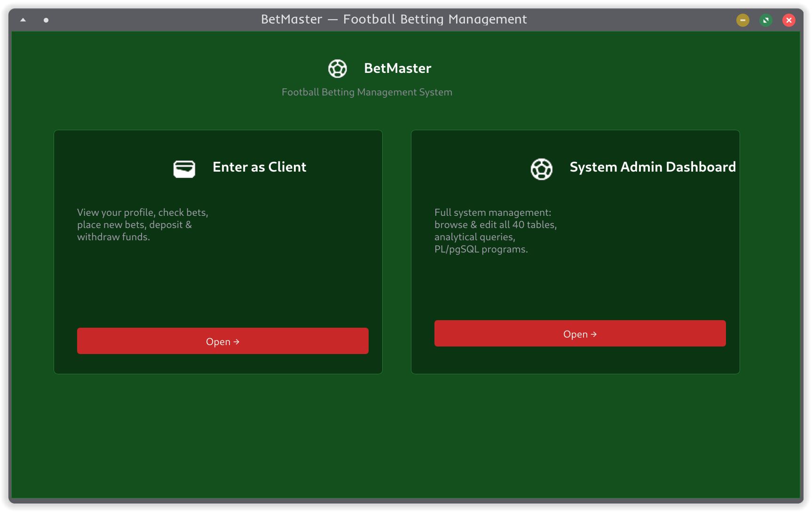
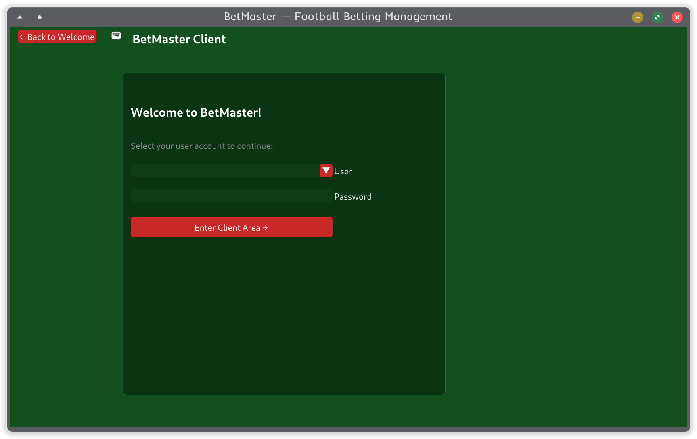
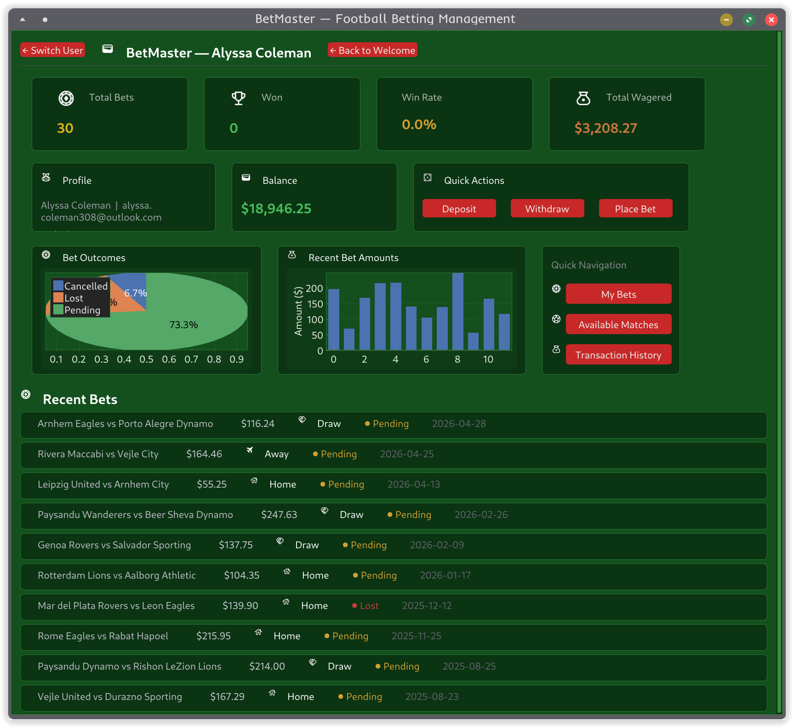
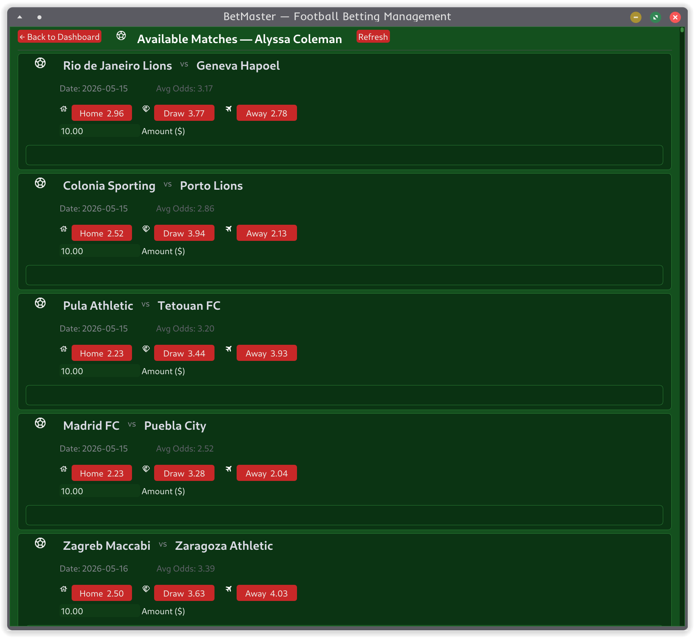
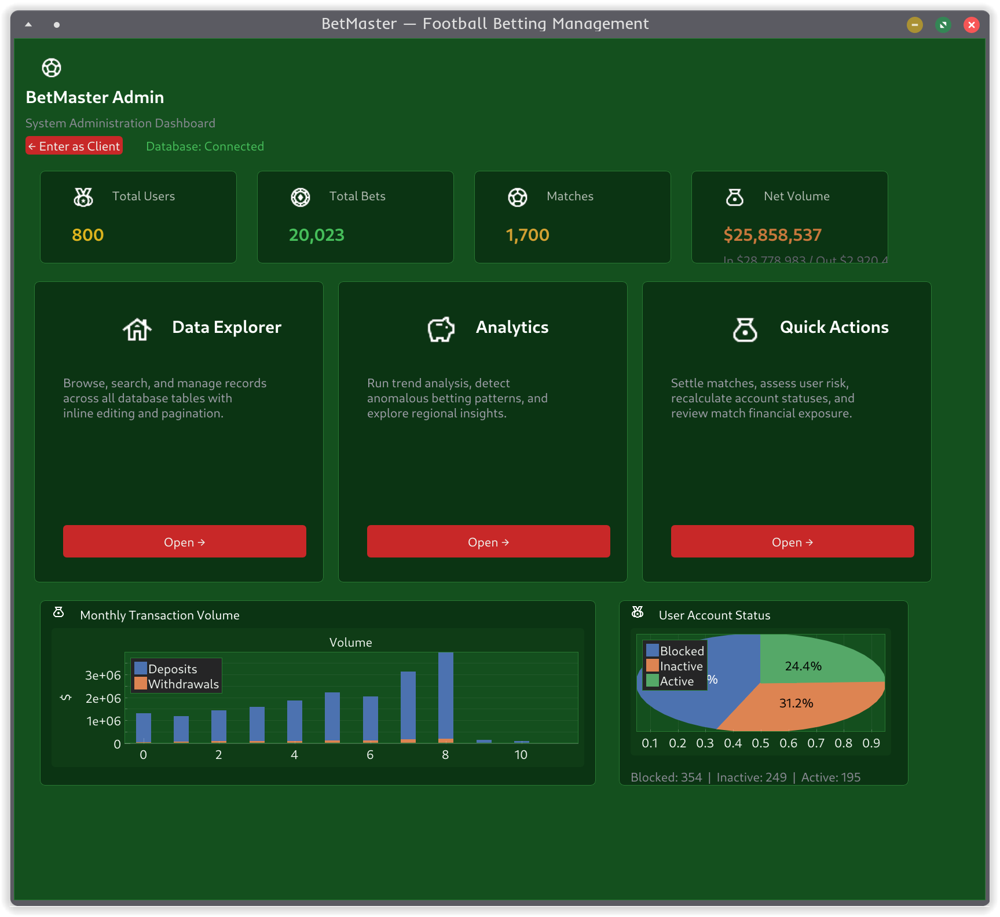
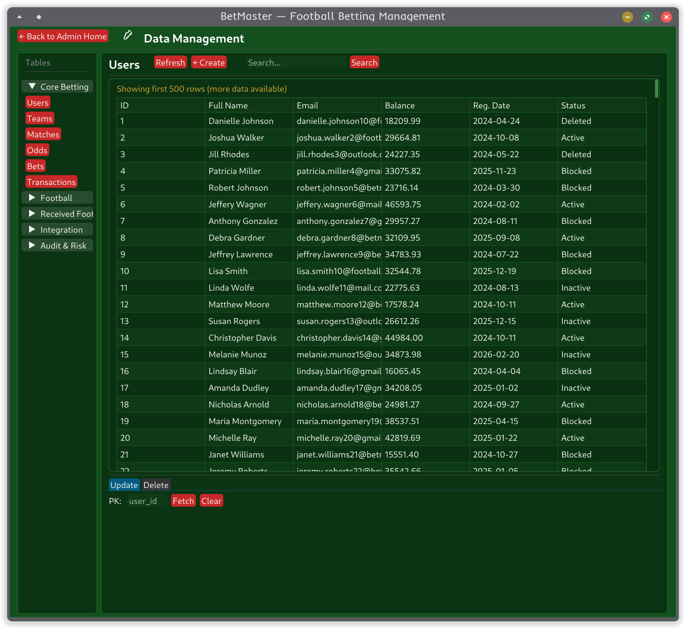
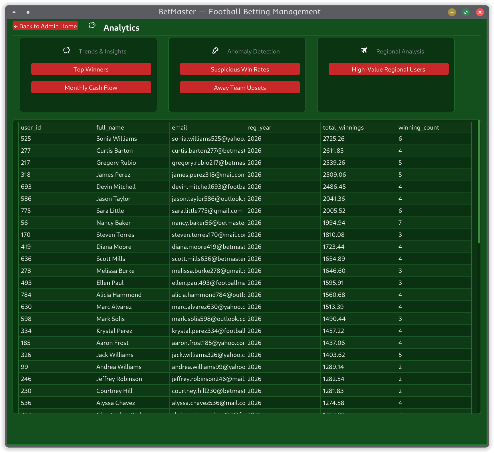
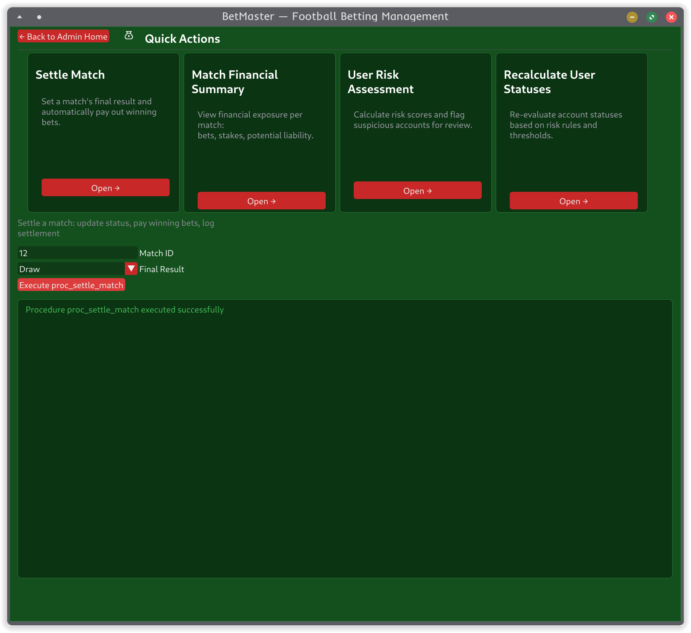

# BetMaster – Stage E (GUI)

Python desktop GUI for the BetMaster betting-database system. Built with **Dear PyGui** (+ *psycopg2* for PostgreSQL).  
Supports two roles: **Client** (place bets, manage funds) and **Admin** (full CRUD, analytics, PL/pgSQL).

---

## How to Run

```powershell
# 1. Start PostgreSQL (from project root)
docker compose up -d

# 2. Install Python dependencies
cd .\שלב_ה
python -m pip install -r requirements.txt

# 3. Launch the app
python main.py
```

The app auto-connects to `localhost:5432 / betmaster / betmaster_user / betmaster_pass`.

---

## How to Use (walkthrough)

### Welcome Screen

Two entry points:

|  |
|:---:|
| Click **Enter as Client** or **System Admin Dashboard** |

### Client Mode

|  |  |
|:---:|:---:|
| Pick a user and click *Enter Client Area* | View stats, balance, charts, recent bets |

|  |
|:---:|
| Browse available matches, pick a prediction (Home/Draw/Away), enter amount, and place the bet |

From the client dashboard you can also **Deposit**, **Withdraw**, view **My Bets**, and see **Transaction History**.

### Admin Mode

|  |
|:---:|
| System-wide stats, monthly volume chart, user-status distribution. Three action areas below |

|  |  |
|:---:|:---:|
| Browse, search, create, update, delete any of the 40+ tables | Run analytical queries: top winners, suspicious patterns, cash flow, regional insights |

|  |
|:---:|
| Execute PL/pgSQL programs: settle a match, recalculate user statuses, view match financial summary, run risk assessment |

---

## How the App Is Built

```
שלב_ה/
├── main.py                 # Entry point — opens DB connection, creates app, runs event loop
├── requirements.txt        # Python dependencies
├── db/
│   ├── __init__.py
│   ├── connection.py       # PostgreSQL connection via psycopg2
│   └── repository.py       # Metadata for 40+ tables, CRUD, analytical queries, PL/pgSQL execution
├── ui/
│   ├── __init__.py
│   └── app.py              # All GUI code: screens, navigation, theme, tables, forms, charts
├── assets/
│   ├── background_small.png
│   └── png/                # Icon textures (sports_soccer, wallet, trophy, etc.)
└── screenshots/            # Documentation images
```

| File | What it does |
|------|--------------|
| `main.py` | Starts everything — connects to DB via `DatabaseConnection`, creates a `Repository`, instantiates `BetMasterApp`, and runs the Dear PyGui loop |
| `db/connection.py` | Thin wrapper around `psycopg2` — connect, disconnect, execute queries, get cursor |
| `db/repository.py` | The data layer. Holds table metadata (columns, PKs, FKs, display names), implements all CRUD operations, analytical queries (Top Winners, Suspicious Patterns, etc.), and PL/pgSQL program execution (settle match, risk report, etc.) |
| `ui/app.py` | The entire GUI in one file (~1700 lines). Organized as a `BetMasterApp` class with methods for each screen (`_show_welcome`, `_show_client_dashboard`, `_show_admin_home`, `_show_data_screen`, etc.), plus visual components (`_make_card`, `_render_stat_card`, `_render_pie_chart`, `_render_bar_chart`, `_render_status_badge`) |

### GUI structure

- **Theme**: Football-pitch green background, red buttons (jersey red), white headings, gold stats, yellow-card warnings, red-card danger
- **Layout**: Single `main_window` with dynamic children — each screen clears and rebuilds the content. Navigation via top bar with back buttons and sidebars
- **Screens are methods** in `BetMasterApp` — `_show_welcome()`, `_show_client_select()`, `_show_client_dashboard()`, `_show_admin_home()`, `_show_data_screen()`, `_show_analytics_screen()`, `_show_quick_actions_screen()`. Each deletes existing children, rebuilds its UI, and sets `self.current_screen`
- **Charts**: Pie series (normalized manually) for bet outcomes / user status; bar series for bet amounts / transaction volume
- **CRUD**: Table metadata drives dynamic forms — FK columns get combo boxes with human-readable values, PK columns are used for update/delete targeting
- **Password field**: Present on the login screen but performs no validation (placeholder for future auth)
